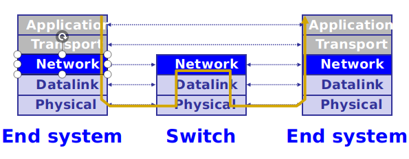
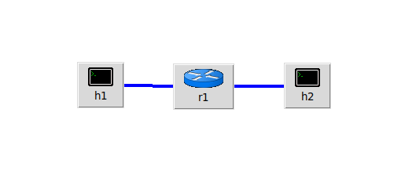
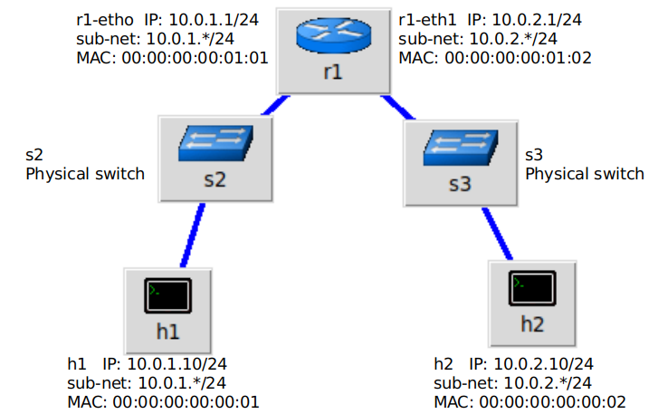
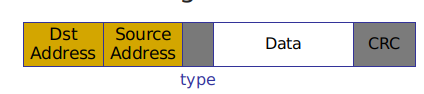
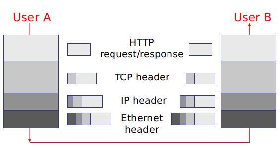
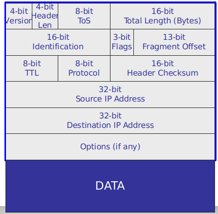
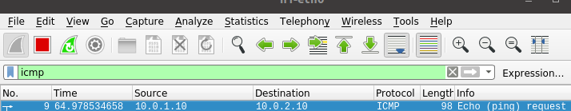
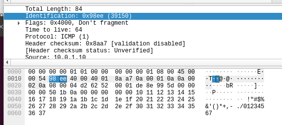
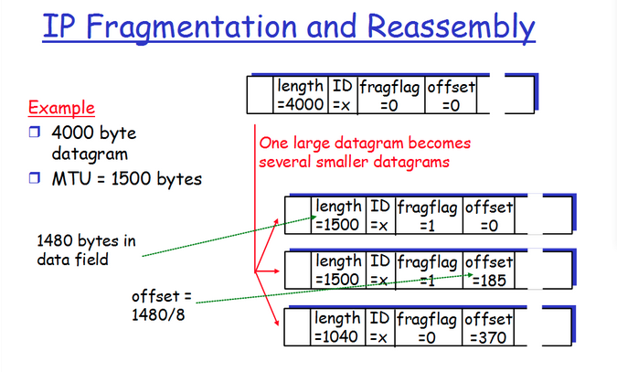

# Assignment 3 IP layer: simple router
## Due Oct. 23, 2019, 11:59PM (GMT+8)

### Correction
In assign2 section1.2 , the IP packet should looks like this:

#Datalink Header# #IP Header# #DATA#

### Overview
So far, we have learned topology, switch, ping, Wireshark and STP.

Remember what the architecture looks like,

<center>

</center>

Now you have approached the Network layer, it's time to figure out how the network works.

In this assignment we need you to combine all knowledge learned before and answer the question about how one Network layer packet is transmitted from one end system to another(only through lower 3 layers).

### Part 1 Build the network.
In assignment-1 we used `adtopo.py` to act as a topology input script with mininet using default settings for other components.

However in assignment-2, we provided a `loop.py` , in which everything was set using python APIs. In general, the main difference from assignment-1 is that, instead of using mininet to run python scripts, we can not directly run python scripts to achieve the same purpose.

And now in assignment-3 we will try to simulate how 2 end systems with different IP addresses and in different sub-nets ping each other via router.

In the terminal, you can use add`--mac` when starting mininet and mininet will automatically allocate MAC addresses starting from `00:00:00:00:00:01` instead of random MACs. You can also manually allocate MAC address and IP address via `h1 = net.addHost('h1', ip="10.0.1.10/24", mac="00:00:00:00:00:01", defaultRoute = "via 10.0.1.1")` which is the way we achieved in `router.py`.

The network we built in `router.py` has a logical topology looking like this:

<center>

</center>

And it's physical topology is this:

<center>

</center>

Use `$ sudo python router.py` to activate our network and `mininet> pingall`. The result should be 0% dropped.

In SDN, a common way to implement a router is to use a controller to overlay a switch, as is what we have done in assignment-2. But in assignment-3 we will use a more original way to achieve a router via Linux kernel function and Terminal tools.

We first use a switch `r1` to represent a router and then in `r1`'s Terminal, we invoke Linux built-in functions:

```
$ ifconfig r1-eth0 hw ether 00:00:00:00:01:01
$ ifconfig r1-eth1 hw ether 00:00:00:00:01:02
$ ip addr add 10.0.1.1/24 brd + dev r1-eth0
$ ip addr add 10.0.2.1/24 brd + dev r1-eth1
$ echo 1 > /proc/sys/net/ipv4/ip_forward
```
Which is to say, we manually set route-rules for `r1`, then `r1` works like a router instead of a switch.

Then we need you to ping between `h1` and `h2` via command `mininet> h1 ping h2 -c1`.

### Part 2 Headers and addresses

Recalling assignment-2, we know that one ping procedure consists of sending one ICMP packet from source to destination and back. Now we want you to capture via Wireshark this process and answer the following questions.

First for datalink layer/Ethernet frame, the packets is consisted with(slides 21),

<center>

</center>

For datalink layer, the data part is consisted with IP header | TCP header | HTTP | Data. Remember the packets in link:

#Datalink Header(destination|source|type)# #IP Header# #DATA#(slides 02)

<center>

</center>

For IP layer, the packet(datalink's data part) is consisted with(slides 31)

<center>

</center>

And we know that ICMP is a IP layer protocol, which is to say that as we are sending packets from h1 to h2 and back the router/switch will at least change the datalink header and IP header due to reasons like different destinations, different check sum, different TTL(time to live), different IDs...

Now open Wireshark and `mininet> h1 ping h2 -c1` then use Wireshark to capture packets and answer questions. We hope you will have a better understanding about how network 'works'.
```
$ sudo python router.py
mininet> pingall

# In mn, Wireshark only runs on end systems(routers hosts)
# But you can still use Wireshark to listen on switches' link like s2-eth0 s2-eth1 s3-eth0 s3-eth1
# You can open as many xterm as you want
mininet> xterm h1 h2 r1 s2

# In h1|h2|r1|s2 and others
$ Wireshark
$ click the link you want to listen/capture

# In mn clinet
$ mininet> h1 ping h2 -c1
# See what's gonna happened in Wireshark
```

First you can open many xterms and use Wireshark to listen to each one link or use Wireshark to listen `any` which is to say you will capture every packets through this end system.

And in this assignment we only care about ICMP so you can use filter.
<center>

</center>

You can click the binary flow of packet and Wireshark will tell you what this part represents.
<center>

</center>

Answer the following questions and write your answers as answers.pdf. We accept both Chinese/English and your answer should also include the Wireshark screenshot pictures.

Q1 How one packet is delivered from h1 through r1 to h2( you only need to capture h1 h2 r1 ), please describe the questions from aspects like 1.how MAC address changed 2.how IP address changed.(view Linux cooked as encryption)

Q2 Has IP address changed during h1->r1->h2? and how IP header

<center>

</center>

changed during h1->r1->h2 like TTL, ID, Fragmentation information.   

Q3 How Wireshark knows that the packet is Linux cooked or not?

Q4 Size of data part for IP is(IP header is not data)? and considering ICMP has it's header so what the size of data part for ICMP is?

**Do not close yet.**

### Part 3 Fragmentation

In class, fragmentation happens when the IP packet is lager than lower layer's MTU(i.e. Ethernet's MTU is 1500B),

<center>

</center>

Now we want you to understand how fragmentation works.
```
mininet> xterm h1

# In Wireshark on h2-eth0
delete the ICMP filter and restart the capture(green button)

# In the new open "Node:h1" xterm
$ ping 10.0.2.10 -s 5000 -c1
```
Now we sent and recieved a 5000 bytes IPv4 packet h1->h2 and h2->h1

Now in Wireshark capturing h2-eth0 and with the process h2->h1(10.0.2.10->10.0.1.10)

Q5 how many packets are sent as h2->h1 and each sizes?

Q6 each fragments flags? each fragment offset and its meaning? their total length? and why their total length is bigger than 5000?

### How to submit your Assignment-3

We have solved the problem and you need to submit your assignment via git/GitHub
````
### Pull
# You will recieve a assign_link  
# like(https://github.com/NJU-CS-network-19-fall/assignment3-Your_Screen_Name)
$ git clone assign_link
$ cd Assignment3

# write your answers.pdf and put it under Assignment3/

### Push
$ cd Assignment3
$ git add -A
$ git commit -m "marks/words"
$ git push origin master
````

### Notice

**Please submit your pdf file before Oct 24.**

**Late submission of homeworks and assignments is not accepted.**
