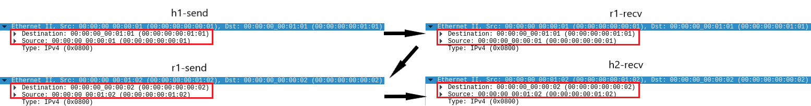
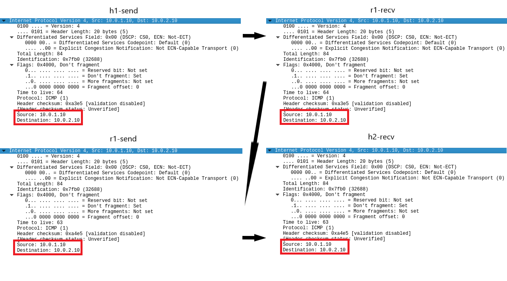
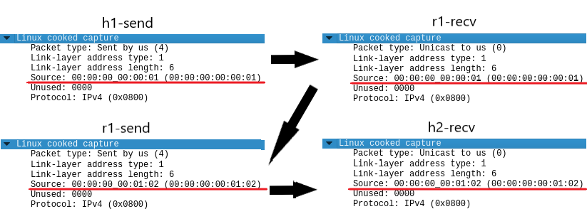
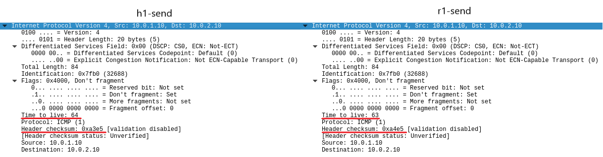
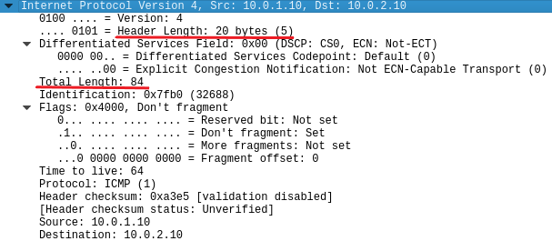
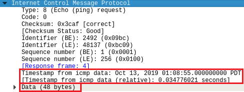
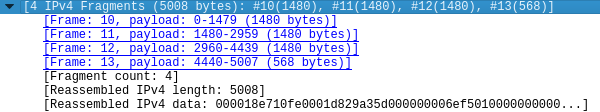
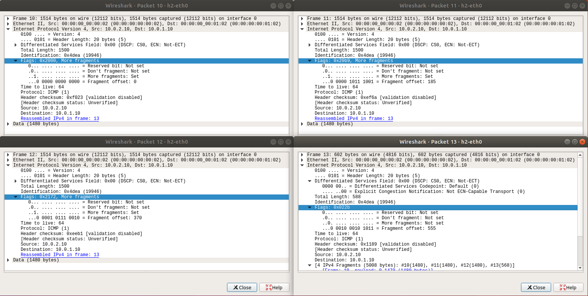

# Experiment 3

### Question 1

Please illustrate the process of a packet being delivered from h1 through r1 to h2 with regard to these aspects:

- How MAC addresses change
- How IP addresses change

Hint: View Linux cooked as encryption

#### Answer 1

##### Non-Linux cooked capture mode

How MAC changes:

How IP changes:

|                 | h1                | r1-recv           | r1-send           | h2                |
| --------------- | ----------------- | ----------------- | ----------------- | ----------------- |
| Source MAC      | 00:00:00:00:00:01 | 00:00:00:00:00:01 | 00:00:00:00:01:02 | 00:00:00:00:01:02 |
| Destination MAC | 00:00:00:00:01:01 | 00:00:00:00:01:01 | 00:00:00:00:00:02 | 00:00:00:00:00:02 |
| Source IP       | 10.0.1.10         | 10.0.1.10         | 10.0.1.10         | 10.0.1.10         |
| Destination IP  | 10.0.2.10         | 10.0.2.10         | 10.0.2.10         | 10.0.2.10         |

##### Linux cooked capture mode

How MAC changes:

How IP changes:

|                | h1                | r1-recv           | r1-send           | h2                |
| -------------- | ----------------- | ----------------- | ----------------- | ----------------- |
| Source MAC     | 00:00:00:00:00:01 | 00:00:00:00:00:01 | 00:00:00:00:01:02 | 00:00:00:00:01:02 |
| Source IP      | 10.0.1.10         | 10.0.1.10         | 10.0.1.10         | 10.0.1.10         |
| Destination IP | 10.0.2.10         | 10.0.2.10         | 10.0.2.10         | 10.0.2.10         |

### Question 2

Have IP addresses in the packet changed during h1 -> r1 -> h2?

Please describe how the IP header has changed during h1 -> r1 -> h2 with regard to:

- TTL
- ID
- Fragmentation information

#### Answer 2

IP addresses did not change during the transmission of h1 -> r1 -> h2, as is displayed in the table above.

This problem can be simplified into comparing the difference of the IP header between h1-send and r1-send. This is because the packet does not change in transmission, meaning that h1-send and r1-recv is the same, and r1-send and h2-recv is the same.

The difference:

The IP header's TTL has been degraded by one and the header checksum was recomputed. Nothing else changed.

### Question 3

How does Wireshark know whether the packet is Linux cooked or not?

#### Answer 3

Citing from https://wiki.wireshark.org/SLL : "When capturing from the 'any' device, or from one of those other devices, in Linux, the libpcap doesn't supply the link-layer header for the real 'hardware protocol' like [Ethernet](https://wiki.wireshark.org/Ethernet), but instead supplies a fake link-layer header for this pseudo-protocol."

From answer 1, we can also see that when setting Wireshark to capture packets on `any`, the link-layer header changes from `Ethernet` to `Linux cooked capture`. This is because capturing in `cooked mode` is done by reading from a PF_PACKET/SOCK_DGRAM socket rather than the more normally used PF_PACKET/SOCK_RAW socket. When using the PF_PACKET/SOCK_DGRAM socket, Linux socket code doesn't supply the packet's link-layer header, so libpcap constructs a synthetic link-layer header from the address supplied.

Finally, in regard to the question asked, if Wireshark is capturing on the `any` device or on any network interface where libpcap uses cooked mode, **all** traffic is SLL traffic. 

### Question 4

What is the size of the data part for IP? Note that the IP header does not count as data.

Considering that ICMP also has it's header, what is the size of the data part for ICMP?

#### Answer 4

The size of the data part for IP is 64.

This can be counted in two ways:

1. IP Total Length - IP Header Length
2. ICMP Total Length

##### IP Aspect of Data Length

Thus we have IP data length = 84 - 20 = 64.

##### ICMP Aspect of Data Length

One line contains 16 bytes, and ICMP takes up 4 lines.

Thus we IP data length = ICMP length = 16 * 4 = 64.

##### ICMP Data Length

The size of the data part for ICMP is 56 bytes, as the two timestamps are actually data too, and they account for 8 bytes of data, resulting in 48 + 8 = 56 bytes.

### Question 5

How many packets are sent from h2 to h1?

What are the sizes of each of these packets?

#### Answer 5

4 packets are sent from h2 to h1.

The sizes of these packets are 1480, 1480, 1480 and 568.

### Question 6

What is each fragment's flags?

What is each fragment's offset and its meaning?

What is the total length of these fragments?

Why is their total length bigger than 5000?

#### Answer 6

##### Flags

|                | Packet 10 | Packet 11 | Packet 12 | Packet 13 |
| -------------- | --------- | --------- | --------- | --------- |
| Reserved bit   | Not set   | Not set   | Not set   | Not set   |
| Don't fragment | Not set   | Not set   | Not set   | Not set   |
| More fragments | Set       | Set       | Set       | Not set   |

##### Offset

|        | Packet 10 | Packet 11 | Packet 12 | Packet 13 |
| ------ | --------- | --------- | --------- | --------- |
| Offset | 0         | 185       | 370       | 555       |

Offset stands for the starting point of a fragment in regard to the original over-sized packet. To be more specific, offset `0` for `Packet 10` means that this fragment starts at the 0 * 8 = 0 byte in the original packet; offset `185` for `Packet 11` means that this fragment starts at the 185 * 8 = 1480 byte in the original packet, which lines up with the `1480` data payload delivered by `Packet 10`; offset `370` for `Packet 12` means that this fragment starts at the 370 * 8 = 2960 byte in the original packet, which lines up with the `2960` data payload delivered by `Packet 10` and `Packet 11`, and so on.

##### Total length

Total length of these fragments is 1500 + 1500 + 1500 + 588 = 5088 bytes.

##### Why

Since each fragment has its own IP header, 4 * 20 = 80 bytes is used by these headers.

The other 8 bytes come from the ICMP header.

