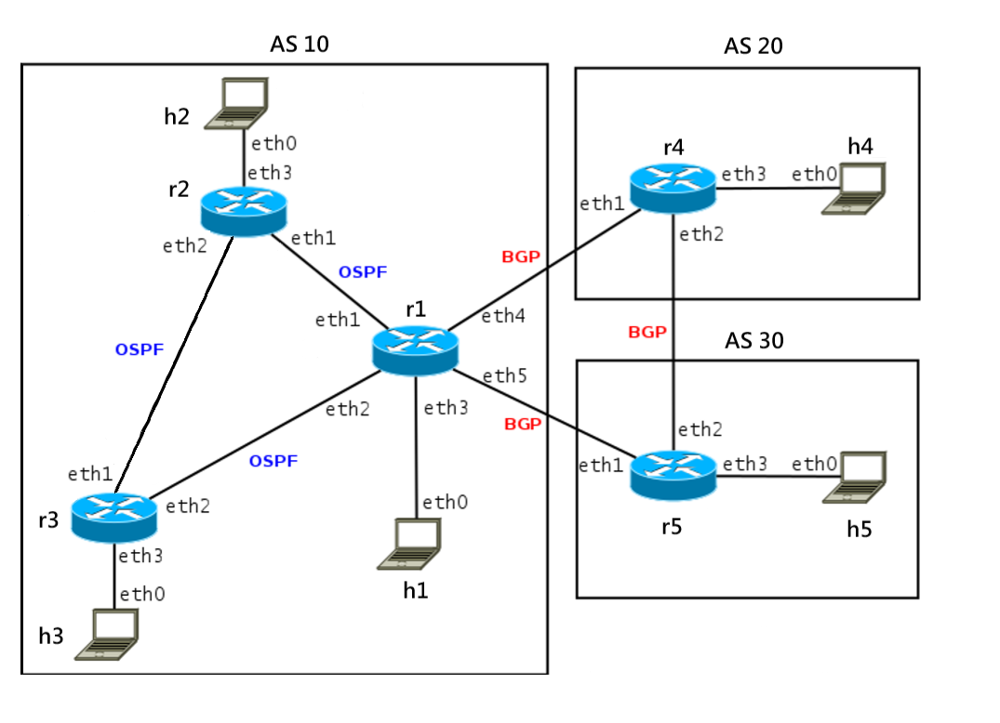

# Instructions

### Eth Topo

### IP Management

| Loopbacks and router IDs | AS 10 OSPF network | BGP peering | Hosts networks |
| ------------------------ | ------------------ | ----------- | -------------- |
| ASN.10.0.x/32            | 10.255.0.x/31      | x.0.0.y/31  | ASN.x.0.0/21   |

| Routers | ASN  | Network    | lo           | eth1          | eth2          | eth3        | eth4        | eth5        |
| ------- | ---- | ---------- | ------------ | ------------- | ------------- | ----------- | ----------- | ----------- |
| r1      | 10   | 10.0.0.0/8 | 10.10.0.1/32 | 10.255.0.2/31 | 10.255.0.7/31 | 10.1.0.1/21 | 10.0.0.2/31 | 10.0.0.4/31 |
| r2      | 10   | 10.0.0.0/8 | 10.10.0.2/32 | 10.255.0.3/31 | 10.255.0.4/31 | 10.2.0.1/21 | NA          | NA          |
| r3      | 10   | 10.0.0.0/8 | 10.10.0.3/32 | 10.255.0.5/31 | 10.255.0.6/31 | 10.3.0.1/21 | NA          | NA          |
| r4      | 20   | 20.0.0.0/8 | 20.10.0.1/32 | 10.0.0.3/31   | 20.0.0.2/31   | 20.1.0.1/21 | NA          | NA          |
| r5      | 30   | 30.0.0.0/8 | 30.10.0.1/32 | 10.0.0.5/31   | 20.0.0.3/31   | 30.1.0.1/21 | NA          | NA          |

| Hosts | ASN  | eth0        |
| ----- | ---- | ----------- |
| h1    | 10   | 10.1.0.2/21 |
| h2    | 10   | 10.2.0.2/21 |
| h3    | 10   | 10.3.0.2/21 |
| h4    | 20   | 20.1.0.2/21 |
| h5    | 30   | 30.1.0.2/21 |

### Notice

It takes approximately 5 seconds for BGP to establish, and 50 to 60 seconds for OSPF to establish on my virtual machine, so I've added a sleep timer.