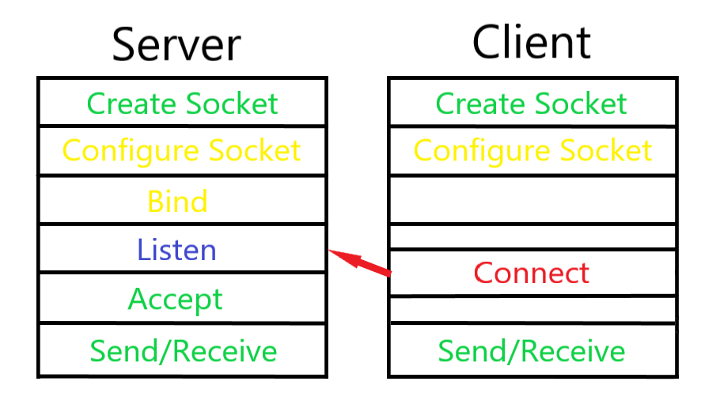

# Assignment 5: Socket Programming
## Due: Nov 20, 2019, 11:59 PM (GMT+8)
### 0 Overview

Previously, we've already dealt with the **Link Layer** and the **Network Layer**. Now, we have finally reached the **Transport Layer**. In other words, we only need to focus on the services provided by the **Transport Layer**, namely TCP and UDP.

To be more concrete, what we are trying to do is `Socket Programming`. The definition is as follows:   

"Socket programming is a way of connecting two nodes on a network to communicate with each other. One socket(node) listens on a particular port at an IP, while other socket reaches out to the other to form a connection. Server forms the listener socket while client reaches out to the server."

Socket is kind of an API based on UDP or TCP, and it is used very widely, much more widely than the lower layer protocols.

If you have questions, please first check [Beej's Guide to Network Programming Using Internet Sockets](https://beej.us/guide/bgnet/) and you may become a master of Socket Programming.

### 1 Hello World!

Like any language you first encounter, we will start with a **Hello World** program.

But this isn't nearly as easy as a **Hello World** program when first encountering C/C++.

Let's see how this process is:

<left>
    
</left>

| Time Slots | 0        | 1      | 2         | 3        | 4                    |
| ---------- | -------- | ------ | --------- | -------- | -------------------- |
| Server     | memset() | bind() | listen()  | accept() | send()/recv()/read() |
| Client     | memset() |        | connect() |          | send()/recv()/read() |

All of these function are in the header file `<sys/socketw.h>`.

Now that we've laid out the process for you, it is time to write down the code.

First create a HelloWorld.c, you can also use .cpp since we won't be testing how fast it runs:

```shell
$ cd ~/Desktop
$ gedit HelloWorld.c
```

Here are the headers you will be using, feel free to remove some of them and see if compiling works:

```c
#include <iostream>
#include <stdlib.h>
#include <string>
#include <stdexcept.h>
#include <signal.h>
#include <bits/stdc++.h>
#include <stdio.h>
#include <unistd.h>
#include <string.h>
#include <sys/types.h>
#include <sys/socket.h>
#include <netinet/in.h>
#include <arpa/inet.h>
#include <netdb.h>
#include <vector>
#include <time.h>
// using namespace std
```

To lessen our workload, we will be implementing the functions of the server and client in the same file and use `-s`, `-c` arguments to discriminate between them:

```c
int main(int argc, char **argv)
{
  if (argc !=  2) {
		printf("Error arguments");
		return 0;
	}
	char mode[strlen(argv[1])];
	strcpy(mode, argv[1]);
	if (strcmp(mode, "-s") == 0) {
		serverMode(argc, argv);
	}
    else if (strcmp(mode, "-c") == 0) {
		clientMode(argc, argv);
	}
    else {
        return -1;
    }
    return 0;
}
```

After that, we need to implement `serverMode()` and `clientMode()` which should follow the pipeline above.

#### 1.1 Server Mode

The basic idea is as below:

```c
serverMode():

// Set port number in [2^10, 2^16] to be safe
int port = some number between [1024, 65535];

// Configure socket
int socketfd = socket(AF_INET, SOCK_STREAM, IPPROTO_TCP);
struct sockaddr_in serverAddr; // IP address structure
memset(&serverAddr, 0, sizeof(serverAddr)); // Initialize socket
serverAddr.sin_family = AF_INET; // Using IPv4
serverAddr.sin_addr.s_addr = inet_addr("127.0.0.1"); // Test on local
serverAddr.sin_port = htons(port); // for specific port, ip:ports

// Bind socket and sockaddr
bind(socketfd, (struct sockaddr*)&serverAddr, sizeof(serverAddr));

// Start listening
listen(socketfd, 5);

//if listen to client
struct sockaddr_in clientAddr;

//accept
socklen_t temp = sizeof(clientAddr);
int acc = accept(socketfd, (struct sockaddr*)&clientAddr, &temp);

//send hello_world
char str[] = "Hello world!\n";
write(acc, str, sizeof(str));

//don't forget to close
close(socketfd);
close(acc);
```
#### 1.2 Client Mode

```c
clientMode():

// Set port number
port = number between [1024,65535] (why?)

//socket set

//connect to server who is listening
connect(socketfd, (struct sockaddr*)&serverAddr, sizeof(serverAddr));

//reas data
char buf[1000];
read(socketfd, buf, sizeof(buf)-1);

printf("%s",buf);

//close
close(socketfd);
```

Please implement the **HelloWorld** program which can work for both server and client.

In case you don't know or have already forgotten, the compile commands are:

```shell
$ g++ HelloWorld.c -o HelloWorld
```

This counts as part of this assignment and should be added under this folder.

### 2 Naïve Bandwidth Measurement Tool

We want you to implement `iperf` with socket programming.

The straightforward idea is to send a lot of bytes, and record the time taken:
$$
BandWidth=BytesTransferred/(EndTime-StartTime)
$$
Notice this idea is different from `Mininet's` [iperf](https://github.com/mininet/mininet/blob/dfb297901fd4bf0ad0cad317973180392dafa277/examples/simpleperf.py). Which accomplishes this by using **UDP** and calls kernel commands. 

There are a lot of different ways to achieve `iperf`, and we accept anything that works. We will grade your `iperf` with `Mininet's` bandwidth setting.

#### 2.1 Requirement
Please write this tool in C/C++ using sockets and this tool should at least measure the bandwidth between two **different** IP address and present the results both in Server/Client mode. The results should be the same.

(Optional)Using multi-check to guarantee the performance measuring your tool with `Mininet's` bandwidth setting.
#### 2.2 Test

Write your Makefile we will run your code via `$sudo make`

Similar to part1, your tool should work on both server and client and you also need to input ip address and port to your_tool with (argc,argv). Thus:
##### Server Mode
This command should be let your tool works as ServerMode

`./YOUR_TOOL -s -p <port-number>`

+ `-s` Server Mode
+ `-p` indicate the following number is your tool's server side's port

You should also write the error checking mechanism in case more/less augments or error ports number beyond [1024,65535]

And after receive data chunks from Client, present the results in this format

`Received=X KB rate=Y Mbps/n`

Where X is the total Bytes received from Client and the rate is X/(Recv_end_time - Recv_start_time).
###### Client Mode
This command should be let your tool works as ClientMode

`./YOUR_TOOL -c -h <Server_IP_address> -p <port-number>`
+ `-c` Client Mode
+ `-h` the following number is Server's IP address(`Socket` also support IPv6 please use IPv4)
+ `-p` the following number is your tool's port notice this port number should be exactly same with Server

And after Client sending data chunks to Server, present the results in this format

`Sent=X KB rate=Y Mbps/n`

Where X is the total Bytes sent to Server and the rate is X/Input_Time.

#### 2.3 Test
You may wanna doing self-check for your tool:

+ Firewall or anti-virus/virus software may shut down the connection(Please use Ubuntu and gcc/g++ with Makefile to do this homework).

+ (optional)Use two computers in same LAN and run your code.

+ Use a virtual machine with a virtual local IP address like(192.168.x.x) virtue-box's Host only adapter or use self-loop IP Address(127.0.0.1) i.e.
````
# In one Terminal
./YOUR_TOOL -s -p <port_number>
# In another Terminal (shift+ctrl+t)
./YOUR_TOOL -c -h 127.0.0.1 -p <port_number>
````

+ Use `mininet`: h1.cmd("./YOUR_TOOL -c -h 127.0.0.1 -p <port_number>")

#### 2.4 Hints

+ Pay little attention to `1B = 8bit  1KB = 1024 byte  1kB = 1000 byte`

**Submit your hello_world.c, iperf.c with makefile and test mininet file test.py via git and Github**
