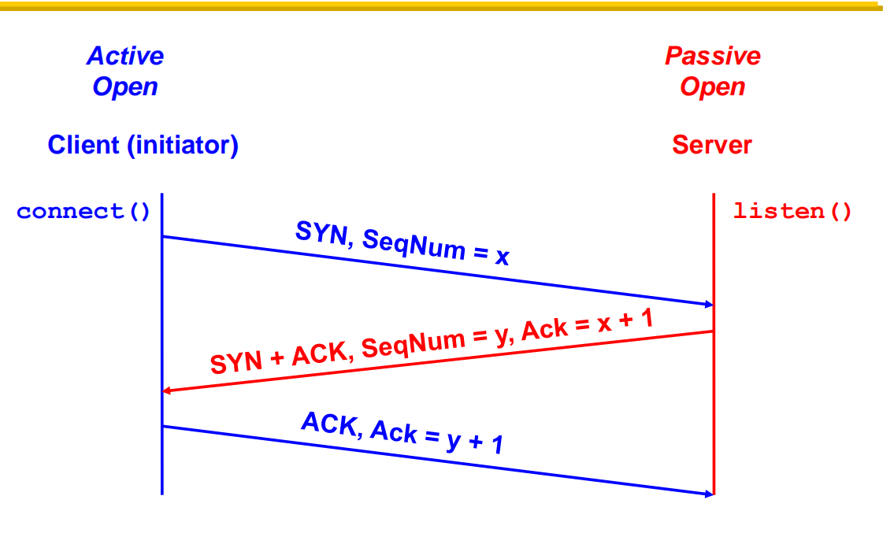
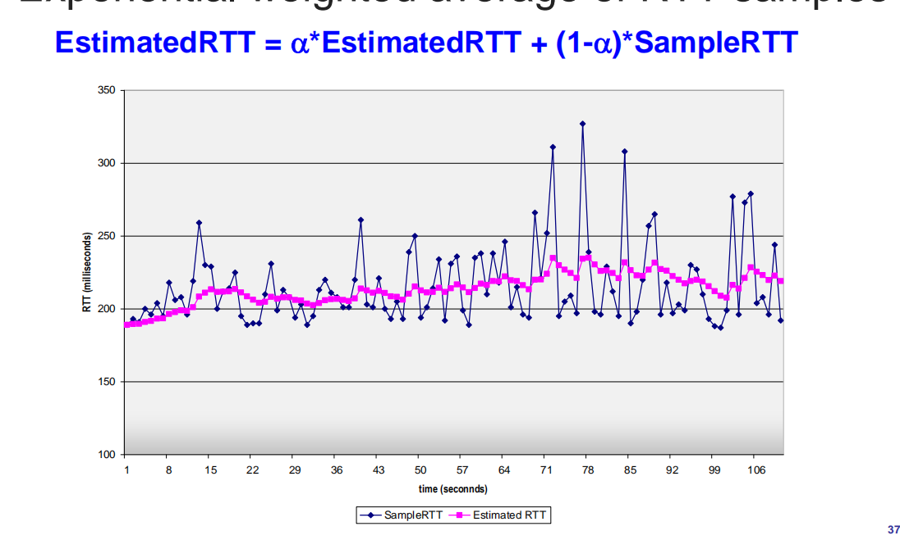
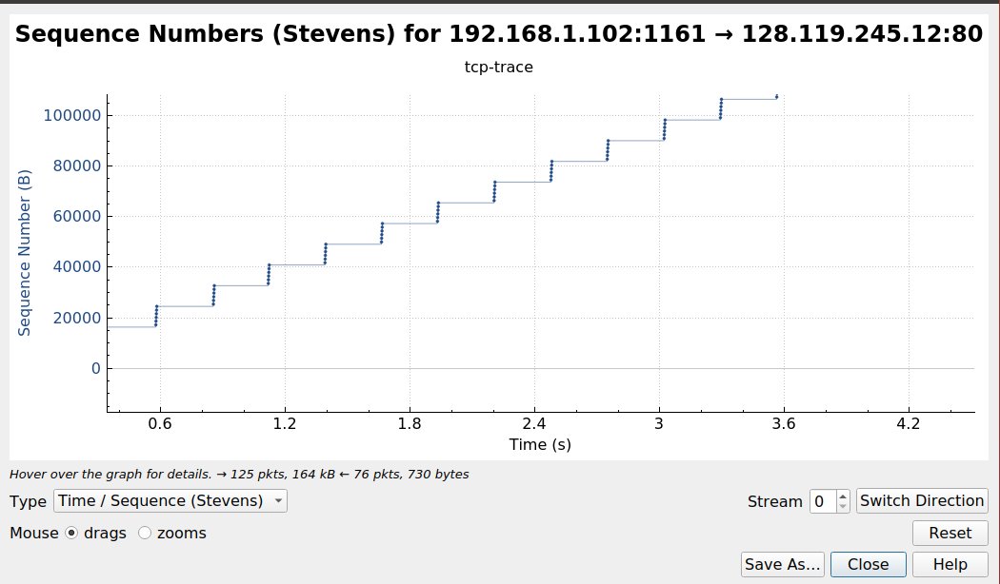
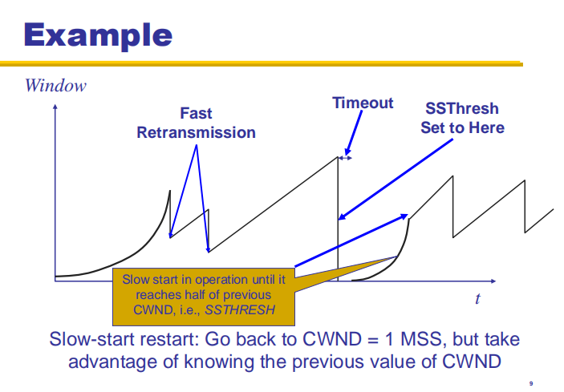

# Assignment 6 Transport layer: TCP
## Due: Dec 04, 2019, 11:59 PM (GMT+8)

### Pre
You should have installed `Wireshark` in assignment 1, but in case something went wrong, install via:

```shell
sudo apt install wireshark
```

Open `wireshark` via `sudo wireshark` and if you meet any errors:

```shell
sudo dpkg-reconfigure wireshark-common
sudo chmod +x /usr/bin/dumpcap
```

### Overview

We've already covered several aspects of TCP in class, such as:

1. IP addresses and ports
2. TCP's 3-way handshaking
3. RTT
4. Congestion control

This experiment is about capturing packets in Wireshark and seeing how these mechanisms work in the real world.

Now open tcp-trace with Wireshark and find out what happened there.

Please write the answers to the following questions in `assign6.pdf` and push it to Github.

### Part 1 TCP Basics

#### Question 1

What is the IP address and TCP port numbers used by the client and the server?

#### Question 2

Can you ping or visit above addresses? Why?

#### Question 3

You were shown the following TCP handshake process in class, can you find the the progress sequence of x and y?

<center>
	
</center>

### Part 2 IP and Ethernet
You only need to be concerned with the first 3 packet (NO.1~3) for Q4 and Q5.

#### Question 4

How do we know if a packet is using TCP or UDP by only looking at a IP header?

What is the checksum for packet NO.1 TCP packet and how many bits can it check?

#### Question 5

Which link layer protocol is used?

What is the value of MTU and MSS?

Why MSS != MTU or in other words, what's the value of MTU - MSS?

### Part3 RTT and RTT estimation

#### Question 6

Draw the RTT and RTT estimate graph like in slides42 with the first 10 packets(NO.1~10) and with `alpha = 0.8` (use TCP-Timestamps as sample RTT)(convenient tool like Excel?)

<center>
	
</center>

### Part4 Congestion Control(CC)

Open TCP time graph via Statistics->TCP Stream Graph->Time Sequence(Stevens)

<center>
	
</center>

#### Question 7

Have you observed the "slow start" and "congestion avoid" states? Is that same to what we learned("slow start RTT" "linear increase window size")? Why?

<center>
	
</center>

**Submit your assign6.pdf via git&&Github**
