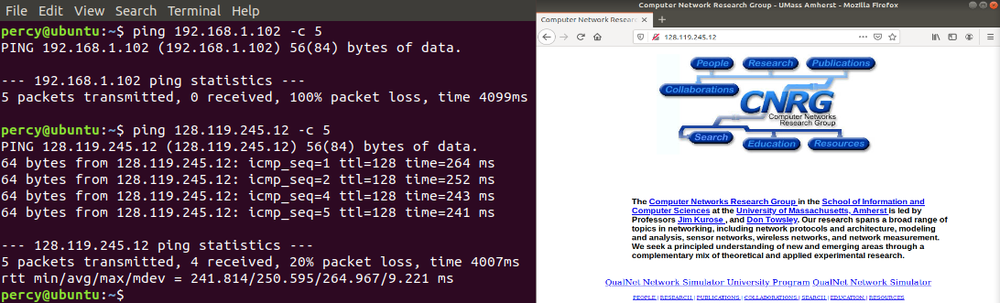
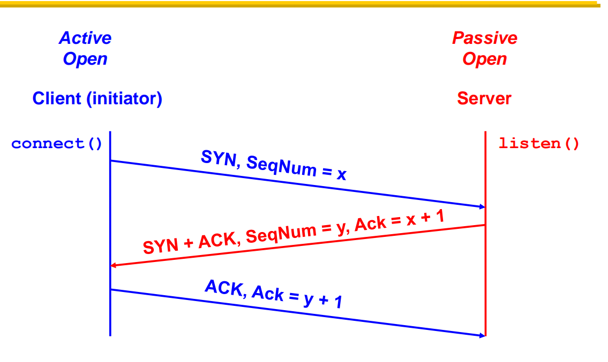
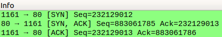
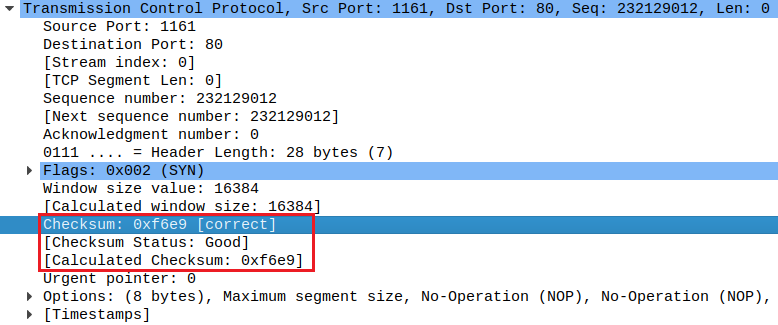
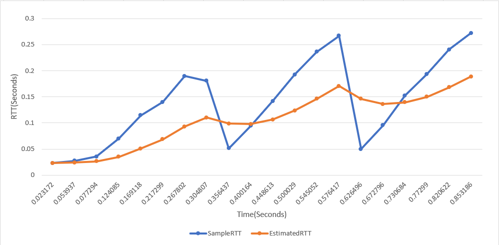

# Assignment 6

This is the intellectual work of **171860611, 王麦迪**.

### Question 1

What is the IP address and TCP port numbers used by the client and the server?

    

|             | Client        | Server         |
| ----------- | ------------- | -------------- |
| IP address  | 192.168.1.102 | 128.119.245.12 |
| Port number | 1161          | 80             |

### Question 2

Can you ping or visit above addresses? Why?

    

`192.168.1.102` is not ping reachable. `128.119.245.12` is ping reachable. `128.119.245.12` is actually the server IP for **University of Massachusetts's Computer Networks Research Group**.

`192.168.1.102` is a private IPv4 address. All private addresses are used inside private networks and can't be routed on the Internet. Personally, I would guess that this host is behind an NAT and was assigned `192.168.1.102` by the DHCP server.

`128.119.245.12` is a public IPv4 address, so it should be reachable unless "magical" borders say otherwise.

### Question 3

You were shown the following TCP handshake process in class, can you find the the progress sequence of x and y?

    
    

I have disabled the `relative sequence number` for TCP in Wireshark to get the actual sequence numbers, and as you can see from above:
$$
x=232129012\\
y=883061785
$$

### Question 4

How do we know if a packet is using TCP or UDP by only looking at a IP header?

What is the checksum for packet NO.1 TCP packet and how many bits can it check?

    

We can obtain this information via the `Protocol` field in the IP header. 6 stands for `TCP`and 17 stands for `UDP`.

    

The checksum is `0xf6e9`.

    

The `Checksum` field in TCP is computed over a pseudo header plus the original TCP segment. But there is a "chicken and egg" situation here since the `Checksum` field is part of the original TCP segment. The normal approach is to set the `Checksum` field to zero for the calculation. In other words, the checksum field field itself doesn't count as the part that is covered in the `Checksum` field. So the `Checksum` field can check:
$$
Pseudo\ Header + TCP\ Segment - Checksum\\
= 12\ bytes + 28\ bytes - 2\  bytes\\
= 38\ bytes\\
= 304\ bits
$$

### Question 5

Which link layer protocol is used?

What is the value of MTU and MSS?

Why MSS != MTU or in other words, what's the value of MTU - MSS?

    

The link layer protocol is `Ethernet II`.

    

Since it is using Ethernet, MTU should be 1500 bytes. From the screenshot above, MSS is 1460 bytes.

    

MTU - MSS is 40 bytes, exactly the combined header length of a TCP header(without options) and an IP header(without options). They are different because MSS represents the maximum size of TCP data payload while MTU represents the maximum size of Ethernet data payload.

### Question 6

Draw the RTT and RTT estimate graph like in slides42 with the first 10 packets(NO.1~10) and with `alpha = 0.8`.

Wireshark itself has an RTT calculation function in `Statistics -> TCP Stream Graphs -> Round Trip Time`, and it looks like this:

    

After figuring out how Wireshark calculated this graph, I found that there are only three `ACKs` coming back from the server in the first 10 packets(I activated the `Analyze TCP sequence numbers` in `Preferences` to make things easier):

    

According to the `SEQ/ACK analysis` provided by Wireshark, also rechecked by my observation of sequence numbers and window sizes, these 3 `ACKs` correspond in this way:

| Packet | Acknowledging Packet Sent by Host |
| ------ | --------------------------------- |
| 2      | 1                                 |
| 6      | 4                                 |
| 9      | 5                                 |

To be frank, I know TA wants to make things easier for us, but I don't see the point in drawing a graph with only 3 points, so I enlarged the range to plot. My initial `Estimated RTT` is the first RTT calculated:

    

### Question 7

Have you observed the "slow start" and "congestion avoid" states? Is that same to what we learned("slow start RTT" "linear increase window size")? Why?

    

The part in the red circle should be the slow start phase. The rest should be the congestion avoid phase.

But this doesn't seem to be same as what we learned in class. When we enter the congestion avoid phase, the TCP window doesn't increase anymore, but instead sends 6 packets every RTT. In other words, there is no linear increase window size, the window size is fixed.