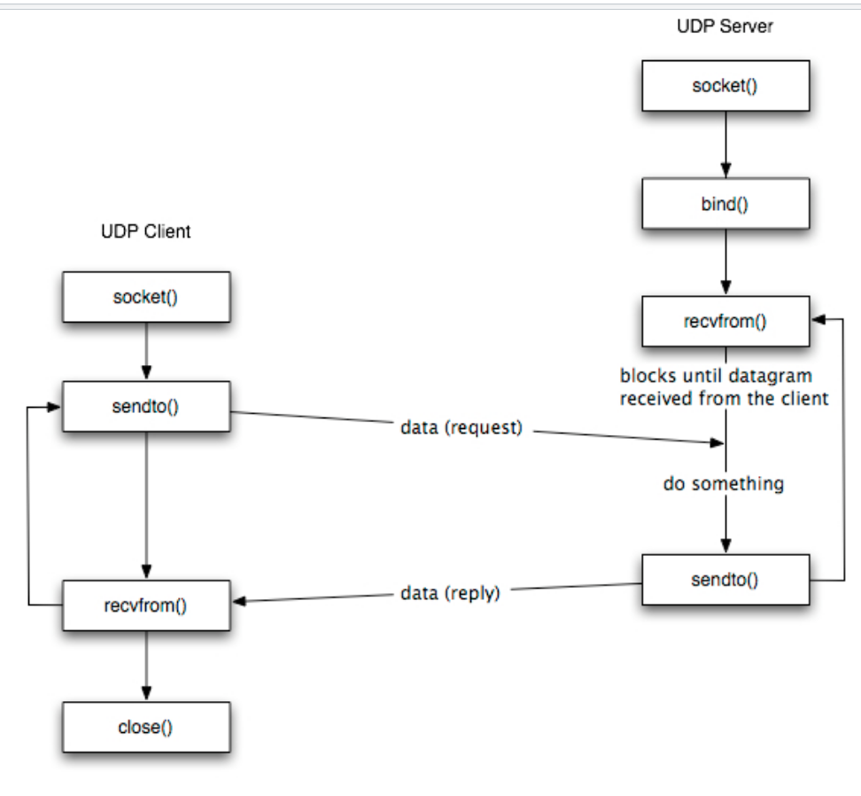

# Assignment 7 Transport Layer: Reliable Transmission Over UDP
## Due: Dec 27, 2019, 11:59 PM (GMT+8)
### Overview

We want you to implement reliable transmission using UDP. The programming part is fundamentally the same as assignment 5 —— socket programming. You can refer to the textbook for the algorithmic part. 

This protocol is named as `TMUDP` —— Trouble Maker UDP.

### Introduction to TMUDP

Tradeoffs are common in the computer world. For example, as you might have learned in `Operating Systems`, in system scheduling, **SJF**(Shortest Job First) will have the best average performance, at consequences of worse user experience. **MLFQ**(Multilevel Feedback Queue Scheduling) improves user experience but works less efficiently.

The tradeoff between TCP and UDP is that, TCP is reliable and UDP is fast.

What we want you to do is to use ACKs and CRC to implement reliable transmission upon UDP. (Sounds familiar to `rdt2.1`?) 

You can view `TMUDP` as a application layer protocol. Everything is implemented in the end systems, we don't have a sliding window anymore, we don't care if the network is congested or not, we don't care about speed or efficiency either. All we care about is that packets arrive correctly and in order.

Submit the answer to the following question as `answer.txt` under this folder:

**How does `TMUDP` make trouble?** Hint: Look at the differences between `TMUDP` and `TCP`. TMUDP cares nothing about middle layer like network traffic and link loss.

### Implementation

Well, don't get me wrong. Although `TMUDP` makes trouble, we believe it should work quite well on stable and little loss link.

You need to write a `client.cpp` which will send a file to a `address:port` which is given via the command line, and a `server.cpp` which will listen on a specific port given via the command line and receive the file.

The following headers are for your reference:
```c++
#include <iostream>
#include <fstream>
#include <stdlib.h>
#include <string>
#include <string.h>
#include <unistd.h>
#include <stdexcept>
#include <signal.h>
#include <bits/stdc++.h>
#include <stdio.h>
#include <unistd.h>
#include <string.h>
#include <sys/types.h>
#include <sys/socket.h>
#include <netinet/in.h>
#include <arpa/inet.h>
#include <netdb.h>
#include <vector>
#include <sys/select.h>
#include <algorithm>
#include <time.h>
#include <math.h>
#include "crc32.h"
// using namespace std
```

UDP communication pipeline works as follows:

<center>
	
</center>

Notice that the MTU for Ethernet is 1500B and UDP has 8B Header + IP's 20B Header which leaves you 1472B for data in each packet.

The client should use 0 as initial sequence number for data packets and use accumulate mechanism via ACK.

#### client.cpp

The client should be able to:

1. Read a file.
2. Split the file into chunks of data.
3. Append the `crc checksum`.
4. Send the packet.
5. Receive an ACK.

The file you are to transmit is `alice.txt`, which can be found within this folder. We have provided you with a `crc32.h` to calculate and check the `crc checksum`. We have also provided you with window_sized limitation(-w) to reduce trouble sizes.

Your client tool should work with this command line:

`./client -f <FileName> -h <ServerIP> -p <ServerPort> -w <WindowSize>`

We only care whether your code can work and pass the test using only UDP.

Hints:

1. You may need to define a `PacketHeader` structure like:

```c++
struct PacketHeader
{
	unsigned int type;     // START,END,DATA,ACK
  	unsigned int sequence; // seq
    unsigned int length;   // data length and 0 for ACK
    unsigned int checksum; // CRC32
};
```

2. Fill the checksum field via `packetHeader.checksum = crc32(data, length)`.
3. Write a packet assemble function using `memcpy`.
4. The easiest implementation is **Send and Wait**.

#### server.cpp

The server should be able to:

1. Receive a packet.
2. Check the `crc checksum`.
3. Buffer the packet if the checksum is correct.
4. Send back an ACK.

Hints:

1. The server should ACK cumulatively.

**Please name your server receive file as FILE without suffix**

We require that the server should have a window size different to the client window size. Consider what will happen if sender overwhelms the receivers' window.

Your server tool should work with this command line:

`./server -d <Directory> -p <ServerPort> -w <WindowSize>`

### Test

You can use a small file and let the client and server be on the same IP(127.0.0.1) to debug.

We offer a test mininet lossy network environment named `test.py` use it via `$ sudo python test.py <linkloss_integer>` with loss=<linkloss_integer>% (for example `$ sudo python test.py 5`) and a test file alice.txt.

Once mininet is set `xterm h1 h4` then send the file with

h4-node:`$ ./server -d $PWD -p <1024~65535> -w <server_windows_sized(#packets)>`

h1-node:`$ ./client -f alice.txt -h 10.0.0.4(h4's IP) -p <same_to_server> -w <client_windows_sized(#packets)>`

Then use `$ diff alice.txt FILE` to check whether they are same.

We will grade your result with loss=5%,1%,0% (maybe a video stream).

**Submit answer.txt and your sender.cpp and receiver.cpp with makefile**
