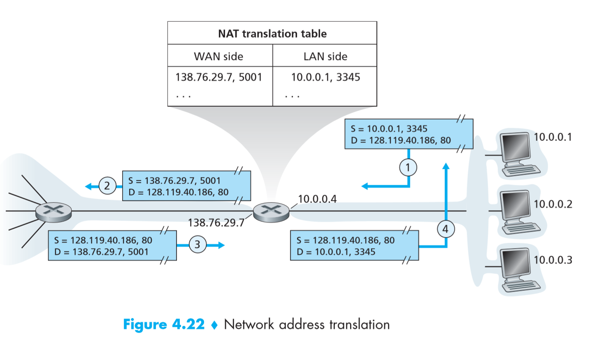
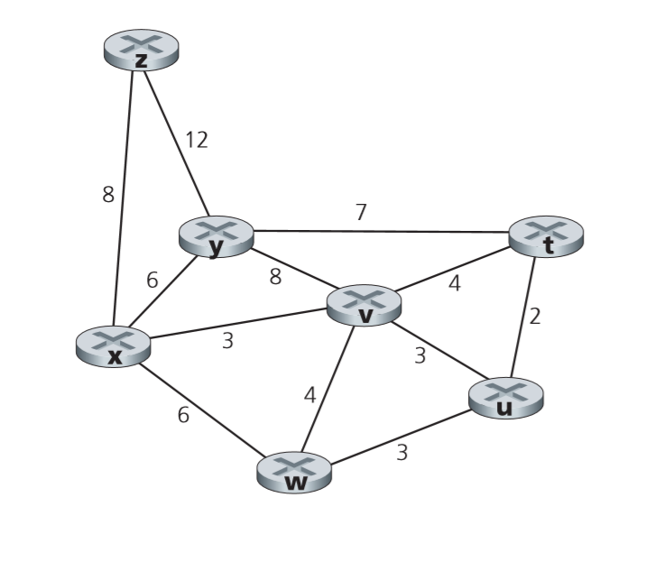
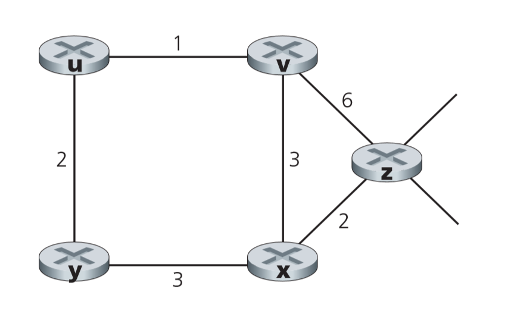
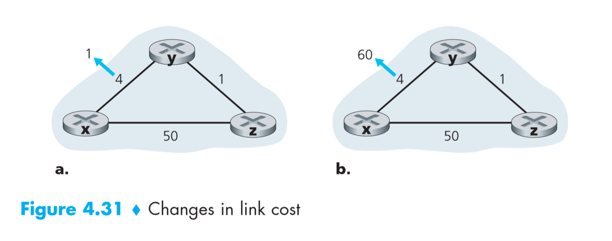

# Homework 3

Intellectual work of **171860611**, **王麦迪**.

## Chapter 6

This part is making up for the problems that I forgot to write last time.

### R7

#### Question

Why are acknowledgments used in 802.11 but not in wired Ethernet?

#### Answer

This is somewhat close to asking why wired Ethernet uses CSMA/CD and why 802.11 uses CSMA/CA. In wired Ethernet, when a node broadcasts a packet out, every other node sharing the same link is sure to hear this broadcast, so they can resolve collision in a distributed way. In 802.11 and any other wireless network, we have the **hidden terminal problem** and **fading**, meaning that nodes may not be able to detect collision even though it may be happening at the receiver’s location. So the receiver has to solve this problem by telling the sender that there wasn't a collision.

###  P5

#### Question

Suppose there are two ISPs providing WiFi access in a particular café, with each ISP operating its own AP and having its own IP address block.

a. Further suppose that by accident, each ISP has configured its AP to operate over channel 11. Will the 802.11 protocol completely break down in this situation? Discuss what happens when two stations, each associated with a different ISP, attempt to transmit at the same time.

b. Now suppose that one AP operates over channel 1 and the other over channel 11. How do your answers change?

#### Answer

a.

The 802.11 protocol will not completely break down, but the bandwidth of channel 11 will be shared by the two APs.

When two stations, each associated with a different ISP, attempt to transmit at the same time, both APs will sense this collision. The APs won’t send back an acknowledgement, and the stations fall back into step 2 of CSMA/CA protocol. The two stations wait a random time to retransmit. If one of the station’s packets finally get through, the AP sends back an acknowledgment.

b.

Then the protocol will run at full potential and there won’t be collision between the two stations.

### P6

#### Question

In step 4 of the CSMA/CA protocol, a station that successfully transmits a frame begins the CSMA/CA protocol for a second frame at step 2, rather than at step 1. What rationale might the designers of CSMA/CA have had in mind by having such a station not transmit the second frame immediately (if the channel is sensed idle)?

#### Answer

This is to achieve fairness between stations. If after a successful transmission, the station starts the CSMA/CA protocol at step 1, the probability of this station’s next packet being transmitted is higher than all the other nodes waiting in backoff. However, by going into step 2, all packets wait a random time, thus making transmission fair.

###  P8

#### Question

Consider the scenario shown in Figure 6.33, in which there are four wireless nodes, A, B, C, and D. The radio coverage of the four nodes is shown via the shaded ovals; all nodes share the same frequency. When A transmits, it can only be heard/received by B; when B transmits, both A and C can hear/receive from B; when C transmits, both B and D can hear/receive from C; when D transmits, only C can hear/receive from D. Suppose now that each node has an infinite supply of messages that it wants to send to each of the other nodes. If a message’s destination is not an immediate neighbor, then the message must be relayed. For example, if A wants to send to D, a message from A must first be sent to B, which then sends the message to C, which then sends the message to D. Time is slotted, with a message transmission time taking exactly one time slot, e.g., as in slotted Aloha. During a slot, a node can do one of the following: (i) send a message; (ii) receive a message (if exactly one message is being sent to it), (iii) remain silent. As always, if a node hears two or more simultaneous transmissions, a collision occurs and none of the transmitted messages are received successfully. You can assume here that there are no bit-level errors, and thus if exactly one message is sent, it will be received correctly by those within the transmission radius of the sender.

a. Suppose now that an omniscient controller (i.e., a controller that knows the state of every node in the network) can command each node to do whatever it (the omniscient controller) wishes, i.e., to send a message, to receive a message, or to remain silent. Given this omniscient controller, what is the maximum rate at which a data message can be transferred from C to A, given that there are no other messages between any other source/destination pairs?

b. Suppose now that A sends messages to B, and D sends messages to C. What is the combined maximum rate at which data messages can flow from A to B and from D to C?

c. Suppose now that A sends messages to B, and C sends messages to D. What is the combined maximum rate at which data messages can flow from A to B and from C to D?

d. Suppose now that the wireless links are replaced by wired links. Repeat questions (a) through (c) again in this wired scenario.

e. Now suppose we are again in the wireless scenario, and that for every data message sent from source to destination, the destination will send an ACK message back to the source (e.g., as in TCP). Also suppose that each ACK message takes up one slot. Repeat questions (a) – (c) above for this scenario.

#### Answer

a.

The cycle of data transmission is:

|      | 1       | 2       |
| ---- | ------- | ------- |
| A    | Silent  | Receive |
| B    | Receive | Send    |
| C    | Send    | Silent  |
| D    | Silent  | Silent  |

1 message/ 2 slots.

b.

|      | 1       |
| ---- | ------- |
| A    | Send    |
| B    | Receive |
| C    | Receive |
| D    | Send    |

2 messages/slot.

c.

|      | 1       | 2       |
| ---- | ------- | ------- |
| A    | Send    | Silent  |
| B    | Receive | Silent  |
| C    | Silent  | Send    |
| D    | Silent  | Receive |

1 message/slot.

d.a

With wireless links replaced with wired links, messages can now be broadcasted within the network without signals fading or colliding.

|      | 1         |
| ---- | --------- |
| A    | Receive   |
| B    | Silent    |
| C    | Send to A |
| D    | Silent    |

1 message/slot.

d.b

|      | 1         |
| ---- | --------- |
| A    | Send to B |
| B    | Receive   |
| C    | Receive   |
| D    | Send to C |

2 messages/slot.

d.c

|      | 1         |
| ---- | --------- |
| A    | Send to B |
| B    | Receive   |
| C    | Send to D |
| D    | Receive   |

2 messages/slot.

e.a

|      | 1       | 2       | 3       | 4       |
| ---- | ------- | ------- | ------- | ------- |
| A    | Silent  | Receive | Send    | Silent  |
| B    | Receive | Send    | Receive | Send    |
| C    | Send    | Silent  | Silent  | Receive |
| D    | Silent  | Silent  | Silent  | Silent  |

1 message/ 4 slots.

e.b

|      | 1            | 2        | 3        |
| ---- | ------------ | -------- | -------- |
| A    | Send Message | Receive  | Silent   |
| B    | Receive      | Send Ack | Silent   |
| C    | Receive      | Silent   | Send Ack |
| D    | Send Message | Silent   | Receive  |

2 messages/ 3 slots.

e.c

|      | 1            | 2            | 3        |
| ---- | ------------ | ------------ | -------- |
| A    | Silent       | Send Message | Receive  |
| B    | Silent       | Receive      | Send Ack |
| C    | Send Message | Receive      | Silent   |
| D    | Receive      | Send Ack     | Silent   |

2 messages/ 3 slots.

## Chapter 4

### R2

#### Question

What are the two most important network-layer functions in a datagram network? What are the three most important network-layer functions in a virtual circuit network?

#### Answer

Datagram network: Forwarding and routing.

Virtual circuit network: Forwarding, routing and connection setup.

### R13

#### Question

What is the 32-bit binary equivalent of the IP address 223.1.3.27? 

#### Answer

| 223      | 1        | 3        | 27       |
| -------- | -------- | -------- | -------- |
| 11011111 | 00000001 | 00000011 | 00011011 |

### R16

#### Question

Suppose an application generates chunks of 40 bytes of data every 20 msec, and each chunk gets encapsulated in a TCP segment and then an IP datagram. What percentage of each datagram will be overhead, and what percentage will be application data? 

#### Answer

Supposing that the `Options` field is empty for both the TCP header and IP header, the packet looks like this:

| IP Header | TCP Header | Data Payload |
| --------- | ---------- | ------------ |
| 20 Bytes  | 20 Bytes   | 40 Bytes     |

So, 50% of overhead and 50% of data for each datagram.

### R19

#### Question

Compare and contrast the IPv4 and the IPv6 header fields. Do they have any fields in common?

#### Answer

Fields they have in common:

| IPv4                | IPv6                |
| ------------------- | ------------------- |
| Version             | Version             |
| Type of Service     | Traffic Class       |
| Total Length        | Payload Length      |
| Time to Live        | Hop Limit           |
| Protocol            | Next Header         |
| Source Address      | Source Address      |
| Destination Address | Destination Address |

### R20

#### Question

It has been said that when IPv6 tunnels through IPv4 routers, IPv6 treats the IPv4 tunnels as link-layer protocols. Do you agree with this statement? Why or why not?

#### Answer

I do. Looking at datagrams from an IPv6 perspective, IPv6 datagrams are encapsulated within IPv4 datagrams. According to layering, this means that IPv4 is lower on the Internet stack than IPv6. Although IPv4 isn't a link-layer protocol, it does the same job as link-layer protocols from the IPv6 perspective.

### P13

#### Question

Consider a router that interconnects three subnets: Subnet 1, Subnet 2, and Subnet 3. Suppose all of the interfaces in each of these three subnets are required to have the prefix 223.1.17/24. Also suppose that Subnet 1 is required to support at least 60 interfaces, Subnet 2 is to support at least 90 interfaces, and Subnet 3 is to support at least 12 interfaces. Provide three network addresses (of the form a.b.c.d/x) that satisfy these constraints.

#### Answer

We know the following:

| Reason | 5 < lg(60) < 6 | 6 < lg(90) < 7 | 3 < lg(12) < 4 |
| ------ | -------------- | -------------- | -------------- |
| Subnet | 223.1.17.x/26  | 223.1.17.x/25  | 223.1.17.x/28  |

But we have to make sure that these three subnets don't collide with each other.

| Subnet             | 223.1.17.(00*)/26 | 223.1.17.(1*)/25 | 223.1.17.(0100*)/28 |
| ------------------ | ----------------- | ---------------- | ------------------- |
| Decimal Expression | 223.1.17.0/26     | 223.1.17.128/25  | 223.1.17.64/28      |

### P19

#### Question

Consider sending a 2400-byte datagram into a link that has an MTU of 700 bytes. Suppose the original datagram is stamped with the identification number 422. How many fragments are generated? What are the values in the various fields in the IP datagram(s) generated related to fragmentation?

#### Answer

$$
ceiling(2380/680) = 4
$$

4 fragments are generated. I will address these fragments as `f1`, `f2`, `f3`, `f4`.

|      | Total Length | Identification | More Fragments Flag | Fragment Offset |
| ---- | ------------ | -------------- | ------------------- | --------------- |
| f1   | 700          | 422            | 1                   | 0               |
| f2   | 700          | 422            | 1                   | 85              |
| f3   | 700          | 422            | 1                   | 170             |
| f4   | 360          | 422            | 0                   | 255             |

### P20

#### Question

Suppose datagrams are limited to 1,500 bytes (including header) between source Host A and destination Host B. Assuming a 20-byte IP header, how many datagrams would be required to send an MP3 consisting of 5 million bytes? Explain how you computed your answer. 

#### Answer

Only knowing the network layer protocol is not enough. We can assume in this scenario that the transport layer protocol is TCP, and that TCP doesn't carry options as well, resulting in a 20-byte TCP header. Thus, each datagram actually carries 1460 bytes of data payload.
$$
ceiling(5,000,000/1460) = 3425
$$

### P21

#### Question

Consider the network setup in Figure 4.22. Suppose that the ISP instead assigns the router the address 24.34.112.235 and that the network address of the home network is 192.168.1/24.

a. Assign addresses to all interfaces in the home network.

b. Suppose each host has two ongoing TCP connections, all to port 80 at host 128.119.40.86. Provide the six corresponding entries in the NAT translation table.

#### Answer

a.

| Host 3      | Host 1      | Host 2      | Router Interface |
| ----------- | ----------- | ----------- | ---------------- |
| 192.168.1.1 | 192.168.1.2 | 192.168.1.3 | 192.168.1.4      |

b.

| WAN Side            | LAN Side          |
| ------------------- | ----------------- |
| 24.34.112.235, 5001 | 192.168.1.1, 3345 |
| 24.34.112.235, 5002 | 192.168.1.1, 3346 |
| 24.34.112.235, 5003 | 192.168.1.2, 3445 |
| 24.34.112.235, 5004 | 192.168.1.2, 3446 |
| 24.34.112.235, 5005 | 192.168.1.3, 3545 |
| 24.34.112.235, 5006 | 192.168.1.3, 3546 |

### P26

#### Question

Consider the following network. With the indicated link costs, use Dijkstra’s shortest-path algorithm to compute the shortest path from x to all network nodes. Show how the algorithm works by computing a table similar to Table 4.3.

#### Answer

| Step | N'      | D(t),p(t) | D(u),p(u) | D(v),p(v) | D(w),p(w) | D(y),p(y) | D(z),p(z) |
| ---- | ------- | --------- | --------- | --------- | --------- | --------- | --------- |
| 0    | x       | ∞         | ∞         | 3,x       | 6,x       | 6,x       | 8,x       |
| 1    | xv      | 7,v       | 6,v       | 3,x       | 6,x       | 6,x       | 8,x       |
| 2    | xvu     | 7,v       | 6,v       | 3,x       | 6,x       | 6,x       | 8,x       |
| 3    | xvuw    | 7,v       | 6,v       | 3,x       | 6,x       | 6,x       | 8,x       |
| 4    | xvuwy   | 7,v       | 6,v       | 3,x       | 6,x       | 6,x       | 8,x       |
| 5    | xvuwyt  | 7,v       | 6,v       | 3,x       | 6,x       | 6,x       | 8,x       |
| 6    | xvuwytz | 7,v       | 6,v       | 3,x       | 6,x       | 6,x       | 8,x       |

### P28

#### Question

Consider the network shown below, and assume that each node initially knows the costs to each of its neighbors. Consider the distance-vector algorithm and show the distance table entries at node z.

#### Answer

|      |      |      |      | To   |      |      |
| ---- | ---- | ---- | ---- | ---- | ---- | ---- |
|      |      | u    | v    | x    | y    | z    |
|      | v    | ∞    | ∞    | ∞    | ∞    | ∞    |
| From | x    | ∞    | ∞    | ∞    | ∞    | ∞    |
|      | z    | ∞    | 6    | 2    | ∞    | 0    |

|      |      |      |      | To   |      |      |
| ---- | ---- | ---- | ---- | ---- | ---- | ---- |
|      |      | u    | v    | x    | y    | z    |
|      | v    | 1    | 0    | 3    | ∞    | 6    |
| From | x    | ∞    | 3    | 0    | 3    | 2    |
|      | z    | 7    | 5    | 2    | 5    | 0    |

|      |      |      |      | To   |      |      |
| ---- | ---- | ---- | ---- | ---- | ---- | ---- |
|      |      | u    | v    | x    | y    | z    |
|      | v    | 1    | 0    | 3    | 3    | 5    |
| From | x    | 4    | 3    | 0    | 3    | 2    |
|      | z    | 6    | 5    | 2    | 5    | 0    |

### P34

#### Question

Consider Figure 4.31. Suppose there is another router w, connected to router y and z. The costs of all links are given as follows: c(x,y) = 4, c(x,z) = 50, c(y,w) = 1, c(z,w) = 1, c(y,z) = 3. Suppose that poisoned reverse is used in the distance-vector routing algorithm.

a. When the distance vector routing is stabilized, router w, y, and z inform their distances to x to each other. What distance values do they tell each other?

b. Now suppose that the link cost between x and y increases to 60. Will there be a count-to-infinity problem even if poisoned reverse is used? Why or why not? If there is a count-to-infinity problem, then how many iterations are needed for the distance-vector routing to reach a stable state again? Justify your answer.

c. How do you modify c(y,z) such that there is no count-to-infinity problem at all if c(y,x) changes from 4 to 60?

#### Answer

a.

After DV-routing is stabilized, each node establishes the following path to x:

|           | y    | w     | z       |
| --------- | ---- | ----- | ------- |
| Path to x | y,x  | w,y,x | z,w,y,x |

So they send the following messages to each other:

|      | y      | w      | z      |
| ---- | ------ | ------ | ------ |
| y    | NA     | D(x)=4 | D(x)=4 |
| w    | D(x)=∞ | NA     | D(x)=5 |
| z    | D(x)=6 | D(x)=∞ | NA     |

b.

There will still be a count-to-infinity problem even if poison reverse is used.

Viewing the intervals between distance vector broadcasting as slots, assume that the link cost change happens within the slot [t0, t1]. Then the three nodes broadcast distance vectors to each other in the following matter:

|      | t0           | t1           | t2            | t3            | t4            | t5            | t6            |
| ---- | ------------ | ------------ | ------------- | ------------- | ------------- | ------------- | ------------- |
| y    | To w, D(x)=4 | To w, D(x)=9 |               |               | To w, D(x)=14 |               |               |
| y    | To z, D(x)=4 | To z, D(x)=∞ |               |               | To z, D(x)=∞  |               |               |
| w    |              |              | To y, D(x)=∞  |               |               | To y, D(x)=∞  |               |
| w    |              |              | To z, D(x)=10 |               |               | To z, D(x)=15 |               |
| z    |              |              |               | To y, D(x)=11 |               |               | To y, D(x)=16 |
| z    |              |              |               | To w, D(x)=∞  |               |               | To w, D(x)=∞  |

As you can see, the count-to-infinity problem is present within y, w, z. The breaking point is when z suddenly decides to go directly to x instead of w. Thus, we map out how z reaches x:

|      | t0   | t1   | t2   | t3   | t4   | t5   | t6   |
| ---- | ---- | ---- | ---- | ---- | ---- | ---- | ---- |
| z    | w,6  | w,6  | w,6  | w,11 | w,11 | w,11 | w,16 |

As can be seen, the growing point at t(3n), and we can reach the equation:
$$
t(3n) = 5n + 6
$$
So the splitting point when z decides to go to x directly is when:
$$
5n + 6 > 50\\5(n-1) + 6 < 50
$$

$$
n = 9
$$

Which means the splitting point is t27. But things aren't finished here, because the system has only jumped out of counting-to-infinity, but it needs more time to reach stability.

|      | t25           | t26           | t27           | t28           | t29           | t30           |
| ---- | ------------- | ------------- | ------------- | ------------- | ------------- | ------------- |
| y    | To w, D(x)=49 |               |               | To w, D(x)=53 |               | To w, D(x)=∞  |
| y    | To z, D(x)=∞  |               |               | To z, D(x)=∞  |               | To z, D(x)=52 |
| w    |               | To y, D(x)=∞  |               |               | To y, D(x)=51 |               |
| w    |               | To z, D(x)=50 |               |               | To z, D(x)=∞  |               |
| z    |               |               | To y, D(x)=50 |               |               |               |
| z    |               |               | To w, D(x)=50 |               |               |               |

After y emits the its distance vector at t30, no updates occur in the system. To be safe, I will say that the system is stable at t31 since we can compare t30, t31 and find that they are the same. But we can't say the same for t29, t30.

Counting from the time slot after link cost changes, 31(30) rounds of DV algorithms occurred before stability.

c.

This is easy, we only need to break the three node loop y->z->w, since two node loops are taken care of by poisoned reverse. Removing one of the three links in {yz, zw, wy} would do the job.