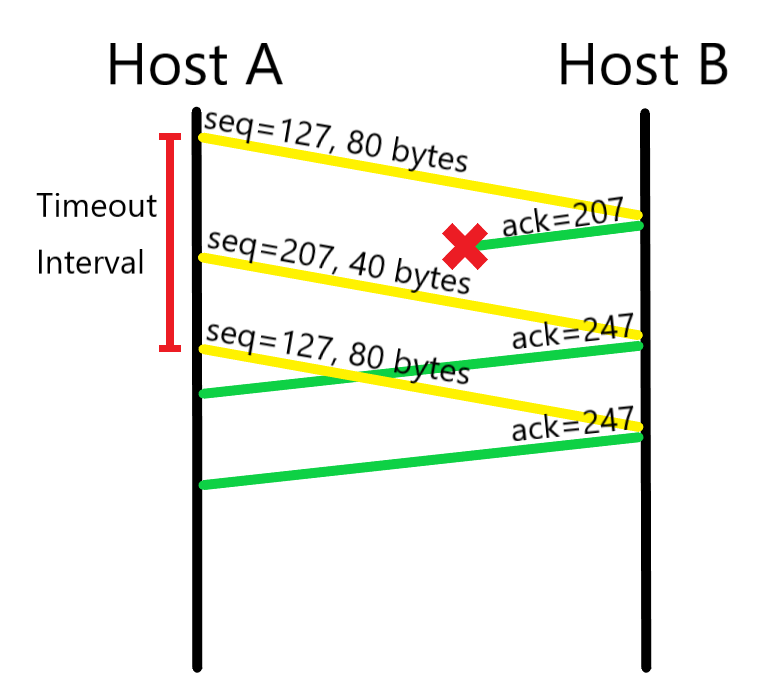

# Chapter 3: Transport Layer

This is the intellectual work of **171860611, 王麦迪**.

## Review Questions

### Question 8

Suppose that a Web server runs in `Host C` on port 80. Suppose this Web server uses persistent connections, and is currently receiving requests from two different Hosts, `A` and `B`. Are all of the requests being sent through the same socket at` Host C`? If they are being passed through different sockets, do both of the sockets have port 80? Discuss and explain.

#### Answer

A TCP socket is identified by a four-tuple: (**Source IP**, **Source Port**, **Destination IP**, **Destination Port**).

In this scenario, (**Destination IP**, **Destination Port**) is fixed, but (**Source IP**) is definitely different. So the requests sent by `Host A` and `Host B` are directed to different sockets at `Server C`.

The two different sockets on `Server C` for `Host A` and `Host B` do have the **Destination Port** 80, but the **Source Port** isn't 80.

### Question 10

In our `rdt` protocols, why did we need to introduce timers?

#### Answer

To deal with packet loss.

### Question 14

True or false?

a. `Host A` is sending `Host B` a large file over a TCP connection. Assume `Host B` has no data to send `Host A`. `Host B` will not send acknowledgments to `Host A` because Host B cannot piggyback the acknowledgments on data.

b. The size of the TCP `rwnd` never changes throughout the duration of the connection.

c. Suppose `Host A` is sending `Host B` a large file over a TCP connection. The number of unacknowledged bytes that A sends cannot exceed the size of the receive buffer.

d. Suppose `Host A` is sending a large file to `Host B` over a TCP connection. If the sequence number for a segment of this connection is m, then the sequence number for the subsequent segment will necessarily be m + 1.

e. The TCP segment has a field in its header for `rwnd`.

f. Suppose that the last `SampleRTT` in a TCP connection is equal to 1 sec. The current value of `TimeoutInterval` for the connection will necessarily be ≥ 1 sec.

g. Suppose `Host A` sends one segment with sequence number 38 and 4 bytes of data over a TCP connection to `Host B`. In this same segment the acknowledgment number is necessarily 42. 

#### Answer

a. False. `Host B` will send acknowledgements to `Host A` saying that it received data.

b. False. The size of the TCP `rwnd` can change due to many factors:
$$
rwnd = RcvBuffer - [LastByteRcvd - LastByteRead]
$$
c. True. This is the upper bound of flow control.

d. False. The sequence number for the subsequent segment should be m + Len.

e. True. The 16-bit **receive window** field is used for flow control.

f. False. It also depends on the current `EstimatedRTT`.

g. False. The acknowledgment number in the same segment is determined by the sequence number sent by `Host B` to `Host A`.

## Problems

### Problem 6

Consider our motivation for correcting protocol `rdt2.1`. Show that the receiver, shown in Figure 3.57, when operating with the sender shown in Figure 3.11, can lead the sender and receiver to enter into a deadlock state, where each is waiting for an event that will never occur.

#### Answer

Since allowing packet loss would make this problem meaningless, let's go through the assumptions for `rdt2.1`:

1. The data packet can be corrupted.
2. The ACK packet can be corrupted.

The first problem is solved by adding ACKs and NAKs; the second problem is solved by adding sequence numbers.

Supposing that `rdt2.1` won't ever enter deadlock, let's compare the difference between Figure 3.12 and Figure 3.57:

1. 'Wait for 0 from below' doesn't deal with sequence number 1.
2. 'Wait for 1 from below' doesn't deal with sequence number 0.

Thus, we've found how the receiver in Figure 3.12 enters deadlock: by sending a packet with sequence number 1 when expecting to receive a packet with sequence number 0, and vise versa. The exact process from correct function to deadlock is as follows:

1. Sender is in 'Wait for call 1 from above' state, receiver is in 'Wait for call 1 from below' state.
2. `rdt_send(data)` interface is invoked, the sender sends a packet with sequence number 1, and enters 'Wait for ACK or NAK 1' state.
3. The receiver receives the packet correctly, sees the sequence number 1, sends back an ACK, and enters the 'Wait for 0 from below' state.
4. The sender receives a corrupt ACK, resends the packet with sequence number 1, and stays in 'Wait for ACK or NAK 1' state.
5. The receiver receives the packet correctly, sees the sequence number 1, sends back an NAK, and stays in 'Wait for 0 from below'.
6. The sender receives the NAK, resends the packet with sequence number 1, and stays in 'Wait for ACK or NAK 1' state.

Now we are in deadlock, with the sender always sending a packet with sequence number 1 and the receiver always sending back a NAK.

### Problem 14

Consider a reliable data transfer protocol that uses only negative acknowledgments. Suppose the sender sends data only infrequently. Would a NAK-only protocol be preferable to a protocol that uses ACKs? Why? Now suppose the sender has a lot of data to send and the end-to-end connection experiences few losses. In this second case, would a NAK-only protocol be preferable to a protocol that uses ACKs? Why? 

#### Answer

Supposing that the sender sends data infrequently, the NAK-only protocol would not be preferable to a protocol that uses ACKs: the loss of packet *x* is only detected by the receiver when packet *x+1* is received. NAKs are really bad when dealing with packet loss in this sense.

Supposing that the sender has a lot of data to send and the end-to-end connection experiences few losses, then a NAK-only protocol is preferable to a protocol that uses ACKs:

1. Less feedback is given by the receiver since errors are infrequent.
2. More precise feedback is given for retransmission.

### Problem 22

Consider the GBN protocol with a sender window size of 4 and a sequence number range of 1,024. Suppose that at time t, the next in-order packet that the receiver is expecting has a sequence number of k. Assume that the medium does not reorder messages. Answer the following questions:

a. What are the possible sets of sequence numbers inside the sender’s window at time t? Justify your answer.

b. What are all possible values of the ACK field in all possible messages currently propagating back to the sender at time t? Justify your answer.

#### Answer

Please note that the book is using the same number for packet and ACK, which is different from TCP ACK.

a. Since the next in-order packet that the receiver is expecting has a sequence number of *k*, we know that the receiver has already received packet *k-1*, and sent ACK *k-1*.

The two boundaries for this scenario are:

1. All ACKs sent back haven't been received by the sender. Thus , the window at the sender is [ k - 4 , k - 1 ]
2. All ACKs sent back have been received by the sender. Thus, the window at the sender is [ k , k + 3 ].

The possible sets of sequence numbers inside the sender's window at time *t* are:

```
{
	{ k - 4, k - 3, k - 2, k - 1},
	{ k - 3, k - 2, k - 1, k},
	{ k - 2, k - 1, k, k + 1},
	{ k - 1, k, k + 1, k + 2},
	{ k, k + 1, k + 2, k + 3}
}
```

b. As we know from (a), the receiver has already received packet *k-1* and sent ACK *k-1*. This means that the right border for the window at the sender is at least *k-1*, and the left border is at least *k-4*. Depending on propagation delay, the sender might have already received ACK *k-4*, ACK *k-3*, ACK *k-2*, ACK *k-1*, or might have not, meaning that they are in flight.

The possible values of the ACK field in all possible messages currently propagating back to the sender at time *t* are:

```
{
	k - 4,
	k - 3,
	k - 2,
	k - 1
}
```

### Problem 23

Consider the GBN and SR protocols. Suppose the sequence number space is of size k. What is the largest allowable sender window that will avoid the occurrence of problems such as that in Figure 3.27 for each of these protocols? 

#### Answer

For Go-Back-N protocol, the largest allowable sender window size is *k-1*. By intuition, the maximum size should be *k*, but in extreme conditions, window size *k* causes problems. When the sender sends all k packets, and the receiver receives all of them correctly, but all ACK are lost on the way back, then the sender retransmits the k packets. However, since the sequence numbers are the same, the receiver thinks that they are new packets.

For Selective-Repeat protocol, the largest allowable sender window size is *k/2*. The upper border is the same as GBN, which means that the sender sends *w* packets, the receiver receives the *w* packets, but the ACKs get lost on the way back. By this point, the relative sender window is [ 0 , w - 1 ], and the relative receiver window is [ w , 2w - 1 ]. To avoid the overlap of sequence numbers, 2w - 1 <= k - 1 (k - 1 is the last sequence number in our relative set since we are starting from 0). Thus, we have w <= k/2.

### Problem 27

Host A and B are communicating over a TCP connection, and Host B has already received from A all bytes up through byte 126. Suppose Host A then sends two segments to Host B back-to-back. The first and second segments contain 80 and 40 bytes of data, respectively. In the first segment, the sequence number is 127, the source port number is 302, and the destination port number is 80. Host B sends an acknowledgment whenever it receives a segment from Host A.

a. In the second segment sent from Host A to B, what are the sequence number, source port number, and destination port number?

b. If the first segment arrives before the second segment, in the acknowledgment of the first arriving segment, what is the acknowledgment number, the source port number, and the destination port number?

c. If the second segment arrives before the first segment, in the acknowledgment of the first arriving segment, what is the acknowledgment number?

d. Suppose the two segments sent by A arrive in order at B. The first acknowledgment is lost and the second acknowledgment arrives after the first timeout interval. Draw a timing diagram, showing these segments and all other segments and acknowledgments sent. (Assume there is no additional packet loss.) For each segment in your figure, provide the sequence number and the number of bytes of data; for each acknowledgment that you add, provide the acknowledgment number. 

#### Answer

a. The sequence number is 126 + 80 + 1 = 207, the source port number is 302 and the destination port number is 80.

b. The acknowledgment number is 126 + 80 + 1 = 207, the source port number is 80 and the destination port number is 302.

c. The acknowledgement number is 126 + 1 = 127.

d.

<center>
    
</center>

### Problem 32

 Consider the TCP procedure for estimating RTT. Suppose that α = 0.1. Let `SampleRTT1` be the most recent sample RTT, let `SampleRTT2` be the next most recent sample RTT, and so on.

a. For a given TCP connection, suppose four acknowledgments have been returned with corresponding sample RTTs: `SampleRTT4`, `SampleRTT3`, `SampleRTT2`, and `SampleRTT1`. Express `EstimatedRTT` in terms of the four sample RTTs.

b. Generalize your formula for n sample RTTs.

c. For the formula in part (b) let n approach infinity. Comment on why this averaging procedure is called an exponential moving average. 

#### Answer

All of the answers below assume that `InitialEstimatedRTT` is the first `SampleRTT`.

a.
$$
EstimatedRTT(1)=SampleRTT_4\\
EstimatedRTT(2)=(1-\alpha) EstimatedRTT(1)+\alpha SampleRTT_3\\
EstimatedRTT(3)=(1-\alpha) EstimatedRTT(2)+\alpha SampleRTT_2\\
EstimatedRTT(4)=(1-\alpha) EstimatedRTT(3)+\alpha SampleRTT_1\\
$$

$$
EstimatedRTT(4)=\\
(1-\alpha)^3 SampleRTT_4+\\
\alpha(1-\alpha)^2 SampleRTT_3+\\
\alpha (1-\alpha) SampleRTT_2+\\
\alpha SampleRTT_1
$$

b.
$$
EstimatedRTT(n)= \alpha\sum_{j=1}^{n-1}(1-\alpha)^{j-1}SampleRTT_j + (1-\alpha)^{n-1}SampleRTT_n
$$
c.
$$
\lim_{n \to \infty}(EstimatedRTT(n)) = \alpha\sum_{j=1}^{\infty}(1-\alpha)^{j-1}SampleRTT_j
$$
It is called an exponential moving average because the weight given to past samples decreases exponentially.

### Problem 36

In Section 3.5.4, we saw that TCP waits until it has received three duplicate ACKs before performing a fast retransmit. Why do you think the TCP designers chose not to perform a fast retransmit after the first duplicate ACK for a segment is received? 

#### Answer

I personally think that the threshold is 3 rather than 2 is to make sure that the packet was lost rather than arriving out of order.

Suppose that the sender has sent three packets *n*, *n+1*, *n+2*, and that the receiver has already received packet *n* and ACK *n*. Now suppose that packet *n+1* and packet *n+2* arrive out of order.

Packet *n+2* triggers an ACK *n*. If the threshold were 2, then this immediately causes the sender to go into 'Fast recovery'. If the threshold were 3, then the sender keeps on waiting for ACKs.

Packet *n+1* triggers an ACK *n+1*. Supposing that the threshold is 3, then the sender window moves forward, it sends packet *n+3*, and hopefully this ACK arrives and the sender avoids going into 'Fast recovery'.

This is a tradeoff between waiting for an additional ACK and avoiding minor RTT fluctuations.

### Problem 40

Consider Figure 3.58. Assuming TCP Reno is the protocol experiencing the behavior shown above, answer the following questions. In all cases, you should provide a short discussion justifying your answer.

a. Identify the intervals of time when TCP slow start is operating.

b. Identify the intervals of time when TCP congestion avoidance is operating.

c. After the 16th transmission round, is segment loss detected by a triple duplicate ACK or by a timeout?

d. After the 22nd transmission round, is segment loss detected by a triple duplicate ACK or by a timeout?

e. What is the initial value of `ssthresh` at the first transmission round?

f. What is the value of `ssthresh` at the 18th transmission round?

g. What is the value of `ssthresh` at the 24th transmission round? h. During what transmission round is the 70th segment sent?

i. Assuming a packet loss is detected after the 26th round by the receipt of a triple duplicate ACK, what will be the values of the congestion window size and of `ssthresh`?

j. Suppose TCP Tahoe is used (instead of TCP Reno), and assume that triple duplicate ACKs are received at the 16th round. What are the `ssthresh` and the congestion window size at the 19th round?

k. Again suppose TCP Tahoe is used, and there is a timeout event at 22nd round. How many packets have been sent out from 17th round till 22nd round, inclusive? 

#### Answer

a. Slow start: [ 1 , 6 ] and [ 23 , 26 ]. This is because the window size grows exponentially.

b. Congestion avoidance: [ 6 , 16 ] and [ 17 , 22 ]. This is because the window size grows linearly.

c. Segment loss is detected by a triple duplicate ACK. This is because the window size is halved.

d. Segment loss is detected by a timeout. This is because the window size is reduced to 1.

e. The initial value of `ssthresh` at the first transmission round is 32. This is because we entered congestion control at round 6 with window size of 32.

f. The value of `ssthresh` at the 18th transmission round is 21. This is because we entered fast recovery at round 16-17 and `ssthresh` was reset to `cwnd/2` = 21.

g. The value of `ssthresh` at the 24th transmission round is 14. This is because we entered fast recovery at round 22-23 and `ssthresh` was reset to `cwnd/2` = 14.

h. The 70th segment was sent in round 7. This is because 63 segments were sent in the slow start stage [ 1 , 6 ].

i. `ssthresh` is `cwnd/2` = 4 and the congestion window size is `ssthresh+3` = 7.

j. `ssthresh` is `cwnd/2` = 21 and the congestion window size is 1.

k. Supposing that this question is built upon (j), the (round, window size) tuples are: (17,1), (18,2), (19,4), (20,8), (21, 16), (22, 21). The total number of packets is 31 + 21 = 52.

### Problem 45

Recall the macroscopic description of TCP throughput. In the period of time from when the connection’s rate varies from W/(2 · RTT) to W/RTT, only one packet is lost (at the very end of the period).

a. Show that the loss rate (fraction of packets lost) is equal to
$$
L=loss\ rate=\frac{1}{\frac{3}{8}W^2+\frac{3}{4}W}
$$
b. Use the result above to show that if a connection has loss rate L, then its average rate is approximately given by
$$
≈\frac{1.22 \ MSS}{RTT \sqrt{L}}
$$

#### Answer

a. During the process in which the window size grows from W/2 to W:
$$
L=\frac{Packets\ Lost}{Packets\ Sent}=\frac{1}{\frac{(\frac{W}{2}+W)}{2}\times(\frac{W}{2}+1)}=\frac{1}{\frac{3}{8}W^2+\frac{3}{4}W}
$$
b. With the result from (a), we can deduce that:
$$
W=\sqrt{\frac{8}{3L}+1}-1≈\sqrt{\frac{8}{3L}}
$$
So we have:
$$
Average\ Rate=\frac{0.75W \times MSS}{RTT}≈\frac{0.75{\sqrt{\frac{8}{3L}}}MSS}{RTT}≈\frac{1.22MSS}{RTT\sqrt{L}}
$$

### Problem 54

In our discussion of TCP congestion control in Section 3.7, we implicitly assumed that the TCP sender always had data to send. Consider now the case that the TCP sender sends a large amount of data and then goes idle (since it has no more data to send) at t1. TCP remains idle for a relatively long period of time and then wants to send more data at t2. What are the advantages and disadvantages of having TCP use the `cwnd` and` ssthresh` values from t1 when starting to send data at t2? What alternative would you recommend? Why?

#### Answer

The advantage is that the TCP connection would no longer have to go through slow start to probe the limits of the connection, so things would be somewhat quicker if the Internet environment hasn't changed much. The disadvantage is that if the Internet environment has gotten worse, starting at such a high speed would make congestion worse.

My suggestion is that the TCP start at fast recovery instead of starting at slow start or congestion avoidance. This guarantees a relatively high start rate, yet not as high as things were at t1.