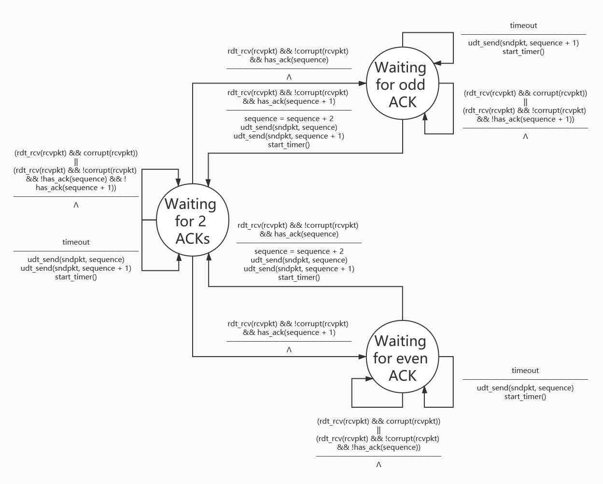

# Homework 5

This is the intellectual work of **171860611, 王麦迪**.

## Chapter 3: Transport Layer

### P3

UDP and TCP use 1s complement for their checksums. Suppose you have the following three 8-bit bytes: 01010011, 01100110, 01110100.

What is the 1s complement of the sum of these 8-bit bytes? (Note that although UDP and TCP use 16-bit words in computing the checksum, for this problem you are being asked to consider 8-bit sums.) Show all work.

Why is it that UDP takes the 1s complement of the sum; that is, why not just use the sum? 

With the 1s complement scheme, how does the receiver detect errors?

 Is it possible that a 1-bit error will go undetected? 

How about a 2-bit error? 

#### Answer

$$
\ \ \ \ 01010011\\
+01100110\\
+01110100\\
=00101110
$$

So the 1s complement of the sum of these 8-bit bytes is 11010001.

It uses the complement of the sum to make it easier for the receiver. All the receiver has to do is add all bytes and check if every bit is 1 or not.

The receiver detects errors by adding all bytes and checking if every bit is 1 or not.

All 1-bit errors will be detected but a 2-bit error might go undetected.

### P18

In the generic SR protocol that we studied in Section 3.4.4, the sender transmits a message as soon as it is available (if it is in the window) without waiting for an acknowledgment. Suppose now that we want an SR protocol that sends messages two at a time. That is, the sender will send a pair of messages and will send the next pair of messages only when it knows that both messages in the first pair have been received correctly. Suppose that the channel may lose messages but will not corrupt or reorder messages.

Design an error-control protocol for the unidirectional reliable transfer of messages.

Give an FSM description of the sender and receiver.

Describe the format of the packets sent between sender and receiver, and vice versa. If you use any procedure calls other than those in Section 3.4 (for example, udt_send(), start_timer(), rdt_rcv(), and so on), clearly state their actions.

Give an example (a timeline trace of sender and receiver) showing how your protocol recovers from a lost packet.

#### Answer

Sender:

    

Receiver:

    

Supposing that the unreliable lower layer can be ignored, the extra fields needed for this protocol are **Flag**, **Sequence Numbers** and **Checksum**. In essence, this is a selective repeat protocol with a fixed window size of 2, meaning that the sequence number set has to have 4 distinct numbers to avoid sequence overlapping. So the format should look something like this:

| Flag {DATA, ACK} | Sequence Numbers {0, 1, 2, 3} | Data   | Checksum    |
| ---------------- | ----------------------------- | ------ | ----------- |
| 1 bit            | 2 bits                        | X bits | 4/8/16 bits |

Now, let's take a look at a packet loss scenario:

| Sender                        | Link    | Receiver          |
| ----------------------------- | ------- | ----------------- |
| Make P0, P1                   |         |                   |
| Send P0, P1                   |         |                   |
|                               | Drop P0 |                   |
|                               |         | Buffer P1, ACK P1 |
| Receive ACK 1, wait for ACK 0 |         |                   |
| P0 timeout, send P0           |         |                   |
|                               |         | Buffer P0, ACK P0 |
|                               |         | Deliver P0, P1    |
| Receive ACK 0                 |         |                   |

### P20

Consider a scenario in which Host A and Host B want to send messages to Host C. Hosts A and C are connected by a channel that can lose and corrupt (but not reorder) messages. Hosts B and C are connected by another channel (independent of the channel connecting A and C) with the same properties. The transport layer at Host C should alternate in delivering messages from A and B to the layer above (that is, it should first deliver the data from a packet from A, then the data from a packet from B, and so on).

Design a stop-and-wait-like error-control protocol for reliably transferring packets from A and B to C, with alternating delivery at C as described above.

Give FSM descriptions of A and C. (Hint: The FSM for B should be essentially the same as for A.)

Also, give a description of the packet format(s) used. 

#### Answer

Sender A:

    

Receiver C:

    

The header fields needed here are **Flag**, **Source Host**, **Sequence Number**, **Checksum**:

| Flag {DATA, ACK} | Source Host {A,B} | Sequence Number {0, 1} | Data   | Checksum    |
| ---------------- | ----------------- | ---------------------- | ------ | ----------- |
| 1 bit            | 1 bit             | 1 bit                  | X bits | 4/8/16 bits |

### P26

Consider transferring an enormous file of L bytes from Host A to Host B. Assume an MSS of 536 bytes.

a. What is the maximum value of L such that TCP sequence numbers are not exhausted? Recall that the TCP sequence number field has 4 bytes.

b. For the L you obtain in (a), find how long it takes to transmit the file. Assume that a total of 66 bytes of transport, network, and data-link header are added to each segment before the resulting packet is sent out over a 155 Mbps link. Ignore flow control and congestion control so A can pump out the segments back to back and continuously.

#### Answer

a. The sequence number in TCP represents the number of bytes of data sent, so the maximum value of L is the number of distinct sequence numbers:
$$
L_{Max} = 2^{32} = 4,294,967,296
$$
 b.
$$
\begin{align*}
Time & = \frac{TotalDataSize}{Speed}\\
& = \frac{TotalHeaderSize+TotalDataSize}{Speed}\\
& = \frac{PacketNum \times HeaderSize + TotalDataSize}{Speed}\\
& = \frac{ceiling(\frac{TotalDataSize}{MSS}) \times HeaderSize + TotalDataSize}{Speed}\\
& = \frac{8,012,999\ packets \times 66\ bytes/packet + 4,294,967,296\ bytes}{155\ Mb/s \times 10^6\ bits/Mb \times \frac{1}{8}\ byte/bits}\\
& = 248.97\ seconds
\end{align*}
$$

### P37

Compare GBN, SR, and TCP(no delayed ACK). Assume that the timeout values for all three protocols are sufficiently long such that 5 consecutive data segments and their corresponding ACKs can be received (if not lost in the channel) by the receiving host (Host B) and the sending host (Host A) respectively. Suppose Host A sends 5 data segments to Host B, and the 2nd segment (sent from A) is lost. In the end, all 5 data segments have been correctly received by Host B.

a. How many segments has Host A sent in total and how many ACKs has Host B sent in total? What are their sequence numbers? Answer this question for all three protocols.

b. If the timeout values for all three protocol are much longer than 5 RTT, then which protocol successfully delivers all five data segments in shortest time interval? 

#### Answer

a.

Go-Back-N:

Host A sends 9 segments in total. These segments are the initial segments 1, 2, 3, 4, 5 and the resent segments 2, 3, 4, 5.

Host B sends 8 ACKs in total. These ACKs are 1, 1, 1, 1 for the initial transmit and 2, 3, 4, 5 for the retransmit.

Selective-Repeat:

Host A sends 6 segments in total. These segments are the initial segments 1, 2, 3, 4, 5 and the resent segment 2.

Host B sends 5 ACKs in total. These ACKs are 1, 3, 4, 5 for the initial transmit and 2 for the retransmit.

TCP(Reno):

Host A sends 6 segments in total. These segments are the initial segments 1, 2, 3, 4, 5 and the resent segment 2.

Host B sends 5 ACKs in total. These ACKs are 2, 2, 2, 2 for the initial transmit and 6 for the retransmit.

b. TCP delivers all five data segments in the shortest time interval. Because upon receiving 3 duplicate ACKs, TCP enters fast recovery and retransmits the missing segment 2 directly without waiting for a timeout.

### P41

Refer to Figure 3.56, which illustrates the convergence of TCP’s AIMD algorithm. Suppose that instead of a multiplicative decrease, TCP decreased the window size by a constant amount. Would the resulting AIAD algorithm converge to an equal share algorithm? Justify your answer using a diagram similar to Figure 3.56. 

Refering from the course PPT:

    

## Chapter 2: Application Layer

### R11

Why do HTTP, FTP, SMTP, and POP3 run on top of TCP rather than on UDP? 

#### Answer

Because the applications that use these protocols need data to arrive in order and complete, unlike real-time streaming. TCP provides reliable transmission while UDP does not, so they use TCP.

### P4

Consider the following string of ASCII characters that were captured by Wireshark when the browser sent an HTTP GET message (i.e., this is the actual content of an HTTP GET message). The characters `<cr><lf> `are carriage return and line-feed characters (that is, the italized character string `<cr>` in the text below represents the single carriage-return character that was contained at that point in the HTTP header). Answer the following questions, indicating where in the HTTP GET message below you find the answer.

> GET /cs453/index.html HTTP/1.1<cr><lf>Host: gaia.cs.umass.edu<cr><lf>User-Agent: Mozilla/5.0 ( Windows;U; Windows NT 5.1; en-US; rv:1.7.2) Gec ko/20040804 Netscape/7.2 (ax) <cr><lf>Accept:ex t/xml, application/xml, application/xhtml+xml, text /html;q=0.9, text/plain;q=0.8,image/png,*/*;q=0.5 <cr><lf>Accept-Language: en-us,en;q=0.5<cr><lf>AcceptEncoding: zip,deflate<cr><lf>Accept-Charset: ISO -8859-1,utf-8;q=0.7,*;q=0.7<cr><lf>Keep-Alive: 300<cr> <lf>Connection:keep-alive<cr><lf><cr><lf>

a. What is the URL of the document requested by the browser?

b. What version of HTTP is the browser running?

c. Does the browser request a non-persistent or a persistent connection?

d. What is the IP address of the host on which the browser is running?

e. What type of browser initiates this message? Why is the browser type needed in an HTTP request message? 

#### Answer

a. http://gaia.cs.umass.edu/cs453/index.html. "http://gaia.cs.umass.edu" is the server's hostname, "/cs453/index.html" is the file that the browser is trying to retrieve from the server.

b. HTTP/1.1. Obvious in the HTTP request.

c. A persistent connnection. This is known from the attribute "Connection:keep-alive".

d. This information cannot be obtained from a HTTP request. We would need to obtain IP level information.

e. Mozilla/5.0. Because different browsers parse data differently and thus need different versions of the same webpage.

### P5

The text below shows the reply sent from the server in response to the HTTP GET message in the question above. Answer the following questions, indicating where in the message below you find the answer.

> HTTP/1.1 200 OK<cr><lf>Date: Tue, 07 Mar 2008 12:39:45GMT<cr><lf>Server: Apache/2.0.52 (Fedora) <cr><lf>Last-Modified: Sat, 10 Dec2005 18:27:46 GMT<cr><lf>ETag: “526c3-f22-a88a4c80”<cr><lf>AcceptRanges: bytes<cr><lf>Content-Length: 3874<cr><lf> Keep-Alive: timeout=max=100<cr><lf>Connection: Keep-Alive<cr><lf>Content-Type: text/html; charset= ISO-8859-1<cr><lf><cr><lf><!doctype html public “//w3c//dtd html 4.0 transitional//en”><lf><html><lf> <head><lf> <meta http-equiv="Content-Type" content="text/html; charset=iso-8859-1"><lf> <meta name=”GENERATOR” content=”Mozilla/4.79 [en] (Windows NT 5.0; U) Netscape]”><lf> <title>CMPSCI 453 / 591 / NTU-ST550A Spring 2005 homepage</title><lf></head><lf> <much more document text following here (not shown)>

a. Was the server able to successfully find the document or not? What time was the document reply provided?

b. When was the document last modified?

c. How many bytes are there in the document being returned?

d. What are the first 5 bytes of the document being returned? Did the server agree to a persistent connection?

#### Answer

a. The server was able to find the document since it returned "200 OK". The document reply was provided at "Tue, 07 Mar 2008 12:39:45GMT", referring to the "Date: Tue, 07 Mar 2008 12:39:45GMT" attribute.

b. The document was last modified at "Sat, 10 Dec2005 18:27:46 GMT", referring to the "Last-Modified: Sat, 10 Dec2005 18:27:46 GMT" attribute.

c. 3874 bytes are in the document being returned, referring to the "AcceptRanges: bytes" and "Content-Length: 3874" attributes.

d. The first 5 bytes are "<!doc". The server agreed to a persistent connection, referring to the "Connection: Keep-Alive" attribute.

### P7

Suppose within your Web browser you click on a link to obtain a Web page. The IP address for the associated URL is not cached in your local host, so a DNS lookup is necessary to obtain the IP address. Suppose that n DNS servers are visited before your host receives the IP address from DNS; the successive visits incur an RTT of RTT1, . . ., RTTn. Further suppose that the Web page associated with the link contains exactly one object, consisting of a small amount of HTML text. Let RTT0 denote the RTT between the local host and the server containing the object. Assuming zero transmission time of the object, how much time elapses from when the client clicks on the link until the client receives the object? 

#### Answer

This request can be abstracted into 3 phases:

1. DNS lookup. We know that n DNS servers are visited before the host receives the IP address, so the time taken here is:

$$
\sum_{i=1}^{i≤n}RTT_i
$$

2. TCP setup. The time taken here is:

$$
RTT_0
$$

3. Webpage request. The time taken here is:

$$
RTT_0
$$

So the time time elapsed from when the client clicks on the link until the client receives the object is:
$$
\sum_{i=1}^{i≤n}RTT_i + RTT_0 + RTT_0 = RTT_0 + \sum_{i=0}^{i≤n}RTT_i
$$

### P20

Suppose you can access the caches in the local DNS servers of your department. Can you propose a way to roughly determine the Web servers (outside your department) that are most popular among the users in your department? Explain. 

#### Answer

We can monitor the DNS cache and keep a record of how long a Web server is in the cache over a certain amount of time. We then sort this table by the "time" column in descendant order and the websites at the top are the most popular ones.

### P21

Suppose that your department has a local DNS server for all computers in the department. You are an ordinary user (i.e., not a network/system administrator). Can you determine if an external Web site was likely accessed from a computer in your department a couple of seconds ago? Explain. 

#### Answer

Under Linux, we can use the `dig` command to query this external Web site. If the query time is small (around 0 ms), it means that the Web site is cached in the local DNS server and thus likely to have been accessed from a computer in the department.

In essence, this is the same as typing a website in the browser and seeing how long it takes, but human reflexes can't tell between 1ms and 50ms.